# 概率论与数理统计

## 重点

$\{1,\cdots,n\}的子集数量是2^n$

德摩根:$\overline{A\cap B}=\overline{A}\cup \overline{B},\overline{A\cup B}=\overline{A}\cap \overline{B},\overline{ABC}=\overline{A}\cup \overline{B}\cup \overline{C}$

减法公式:$P(\overline{A}B)=P(B-A)=P(B)-P(AB)$

当A被包含于B则P(AB)没B

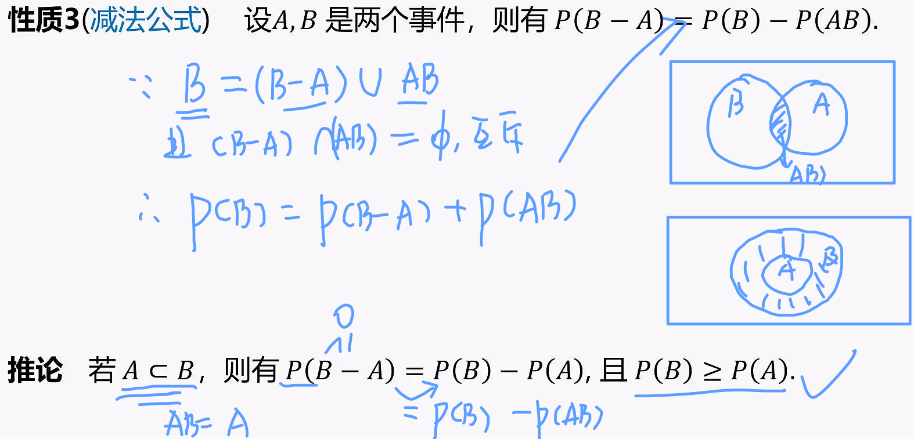

加法公式推广:$P(A\cup B\cup C)=P(A)+P(B)+P(C)+P(ABC)-P(AB)-P(BC)-P(AC)$(两两互斥则去掉减项和P(ABC))

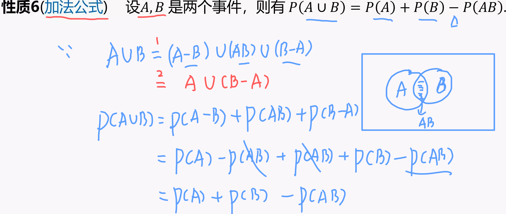

**乘法公式**:$P(B_iA)=P(A|B_i)P(B_i)$如果只有对立的两个事件，那么$B_2=\overline{B_1}$

**概率为0**的事件**未必是不可能**事件，**概率为1**也**未必是必然事件**

若在区间[0，2]中随机地取两个数，则这两个数的和大于1的概率

最简单是画图计算面积[题目链接](http://www.1010jiajiao.com/gzsx/shiti_id_996ca9a3a40e864714c46684c7a08cca)

概率分布函数是概率密度函数的定积分$\int^x_{-\infin}$

分布可增可减，密度只增不减(因为占的越大，含有的可能越高)

$$
X\sim N(20,15),Y\sim (20,10),X-Y\sim N(0,25)\\
\mu_1\pm \mu_2,\sigma^2+\sigma^2
$$

当**总数很多**，不放回也相当于放回

所有事件都只是**近似服从**某种分布

线性用求导，非线性用积分

通过分布函数确定两个变量之间的关系(万能方法，万能公式)

**重点**:联合分布只知道一个变量取值，可以用其两侧的公式相交取得另外一个变量的取值，也有技巧，被积公式若能得到对称轴，其积分一般也对称(一阶)

联合分布可推边缘分布，反之不可，可靠独立性条件等反推

在分布里对X乘除是乘除标准差，如下

$$
\begin{aligned}
&X_i\sim N(0,2^2)\\
&\frac{X_i}{2}\sim N(0,1)
\end{aligned}
$$

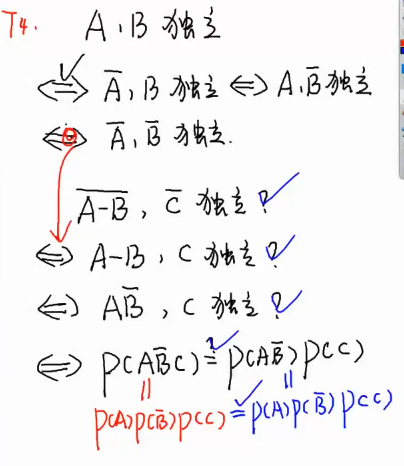

## 随机试验

确定性(必然)：一定发生(不发生)

随机(偶然)：可能发生(不发生)

(1)在相同条件下可重复

(2)结果不止一个

(3)无法测验

**基本事件不可再分**(相对于试验目的，不必再分)

必然事件$\Omega$

不可能事件$\phi$

**样本空间**：所有基本事件的集合

**样本点**：样本空间的元素

例子：样本空间$\Omega=\{0,1,2,\cdots,n,\cdots\}$(学校内用S)

$\Omega=\{ (x,y)|x,y\in R \}$

和事件:大$\cup$

积事件:大$\cap$

$A-B=A\cap \overline{B}$

可列集:能以某种序列列举，有限集不是可列集，有理数集是可列集，实数级不是

---

### 互不相容事件与对立事件

互斥事件(互不相容事件):AB=$\phi$

对立事件

$$
\begin{aligned}
&A\cup B=\Omega \\
&AB=\phi 且 A+B=\Omega\\
&A=\overline{B}\\
&B=\overline{A}\\
&A-B=A-AB=A\overline{B}
\end{aligned}
$$

**最后一个重点记忆**

(1)对立一定互不相等

(2)互不相等适用于多个事件，但是只适用于两个事件

(3)互不相容，不同时发生，可都不发生，对立有且只有一个

---

### 完备事件

$$
\begin{aligned}
&A_1,A_2,\cdots,A_n两两不相容且有\overset{n}{\cup}_{i=1}A_i=\Omega\\
&(1)交换律\\
&A\cup B=B\cup A\\
&A\cap B=B\cap A\\
&(2)结合律\\
&(A\cup B)\cup C=A\cup (B\cup C)交集同理\\
&(3)分配律\\
&(A\cup B)\cap C=(A\cap C)\cup (B\cap C)\\
&(A\cap B)\cup C=(A\cup C)\cap (B\cup C)\\
&(4)对偶性\\
&\overline{A\cup B}=\overline{A}\cap \overline{B}\\
&\overline{A\cap B}=\overline{A}\cup \overline{B}
\end{aligned}
$$

例子：抽查产品不放回三次

(1)三次合格：$A_1A_2A_3$

(2)至少一次合格：$A_1+A_2+A_3,A_1\overline{A_2}\overline{A_3}+\cdots$

(3)$\cdots$

(4)$A_2-A_3=A_2\overline{A_3}$：第二次合格第三次不合格

(5)$\overline{A_1+A_2}=\overline{A_1}\cap \overline{A_3}$：第一次和三次不合格

(6)$\overline{A_1}+ \overline{A_3}$：第一次或第三次不合格(第一、三次中至少一次不合格)

### 事件的独立性

$P(AB)=P(A)P(B)$,A、B独立

若A、B独立，则$A与\overline{B},A与\overline{B,}B与\overline{A},\overline{A}与\overline{B}$独立

若$P(A)=0或P(A)=1$,则A与任何事件独立

证明A与B逆独立:

$$
\begin{aligned}
P(\overline{A})(B)&=[1-P(A)]P(B)\\
&=P(B)-P(A)P(B)\\
&=P(B)-P(AB)(独立性)\\
&=P(B-A)\\
&=P(\overline{A}B)
\end{aligned}
$$

三个事件**相互独立**，可以推出**两两独立**，**反之不行**

---

## 概率的初等描述

### 表达

发生某事的概率：P(A)=$\frac{A中包含的样本点/A中包含某事件的权}{\Omega中的样本点/基本事件综合}$

---

### 古典概型

#### 条件

(1)有限个可能

(2)可能性相同

#### 性质

(1)非负性:$0\le P(A)\le 1$

(2)规范性:$P(\Omega)=1 \ P(\Phi)=0$

(3)有限可加:$A_1 \cdots A_n互不相容 \ P(A_1+A_2+\cdots+A_n)=P(A_1)+\cdots+P(A_n)$

#### 缺点(局限性)

(1)有限个结果

(2)等可能性

---

### 排列组合

(1)不重复排列

$P^m_n=n(n-1)\cdots(n-m+1)=\frac{n!}{(n-m)!}$

(2)全排列

$P^n_n=n!$

$P^0_0=0^1_1=0!=1$

(3)组合

概念：从n个不同元素中取出m个不同元素

$C^m_n=\frac{P^m_n}{m!}=\frac{n!}{m!(n-m)!}$

$C^m_n=C^{n-m}_n$

---

### 概率计算

#### 邮筒

有四个邮筒，两封信件

前面两个邮筒都有信件的可能=$\frac{P^2_2}{4*4}=\frac{1}{8}$

简单说就是排列可能/全排列

#### 小球

有五个白球，四个黑球

任取3个是2白1黑的可能=$\frac{C^2_5 C^1_4}{C^3_9}$

a白b黑任取一个可能性=$\frac{a}{a+b}$

a白b黑任取m个，第m次是白球

法1:$\frac{a(a+b-1)!}{(a+b)!}=\frac{a}{a+b}$

解释:从a个白球中抽出一个，剩下任意排列

法2:$\frac{a*P^{m-1}_{a+b-1}}{P^m_{a+b}}$

解释:同理，不过改为全排列形式，分母是取出m个的全排列，分子是取出a个白球的一个再让剩余取出全排列

---

### 几何概型

#### 例1:会面问题

一般为某一周期内进行某种事时发生某事的概率，比如加一两人在一个钟内，任意先到者等待一刻钟，二人能见面的概率

$|y-x|\le 15(x,y\le 60)$=$\begin{cases}
    y-x\ge 0 \ y-x\le 15 \\
    y-x<0 \ x-y\le 15
\end{cases}$

根据函数可知正方形对角线长要扣掉的两个三角形直角边为45

如图所示

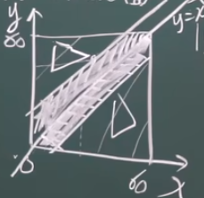

概率=$\frac{60*60-2*\frac{1}{2}*45*45}{60*60}=0.4375$

#### **例2:蒲丰投针**

在两线中间投针(线距d,针长l,l<d)
求针和任意一根线相交概率

设针中点离最近线的距离x($0\le x\le \frac{d}{2}$)，$\phi$为针与线的夹角，则有$\frac{x}{\sin \phi}\le \frac{l}{2}=>x=\frac{l}{2}\sin \phi$

为何x取值如此，假设针无限小或者平躺，那么其中点距离线的距离趋近于0，假设l趋近于d并且竖直，那么最远即是针的一半也即d的一半

这根针存在角度，因为其是线与针的夹角，线是平面，单一方向的话只有180°

为何公式取值是$\frac{x}{\sin \phi}\le \frac{l}{2}=>x=\frac{l}{2}\sin \phi$，因为可以存在针的一部分超出线的情况，所以是小于等于，而大于则说明没有碰到线

最终的两个式子

$$
\begin{cases}
    \Omega = \{ (\phi,x)|0\le \phi \le \pi,0\le x\le \frac{d}{2} \}\\
    G=\{ (\phi,x)|0\le \phi \le \pi,0\le x\le \frac{l}{2}\sin \phi\}
\end{cases}
$$

图：

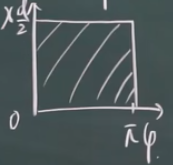

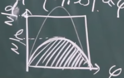

概率为=$\frac{P(G)}{P(\Omega)}=\frac{\int^\pi_0 \frac{l}{2}\sin \phi\mathrm{d}\phi}{\pi *\frac{d}{2}}=\frac{2l}{\pi d}$

拓展：蒙特卡洛求圆周率

诸如此等类型，在一定区域内投掷任意事物(比如在正方形内取点)

假设一共做了N次实验，相交次数为n次

那么前者的计算结果理论上与实验得出的概率一样

$\frac{2l}{\pi d}\approx  \frac{n}{N}$

可以得到$\pi \approx \frac{2lN}{nd}$

需要注意，这不只应用于蒲丰投针中，如果场景更改只需要替换变量对应的值

---

### 公理化(古典、统计)

#### 性质与描述

描述：与古典概型性质相同

性质

(1).$P(\Phi)=0$

(2).可列可加，$\cup P(a_i)=\sum P(a_i)$(让$A_1~A_n$皆空集可证明空集概率=0，若相互独立则可证有限可加)

(3).$P(\overline{A})=1-P(A)$

(4).$\begin{cases}
    P(A-B)=P(A)-P(AB)正常两圈相交\\
    A\supset B,P(A-B)=P(A)-P(B)\& P(A)\ge P(B)大圈包小圈
\end{cases}$

证明:(1)$A=(A-B)\cup AB\&A-B与AB不相容$

(2)$P(A)=P(A-B)+P(AB)\&P(A-B)=P(A)-P(AB)$

因为是大圈包小圈，所以$P(AB)=P(B)$

(5).加法

$P(A+B)=P(A)+P(B)-P(AB)$

当AB互斥可以去掉P(AB)

两圈相交=两大圈相加并减去其交集

---

### 条件概率

$P(A)$无条件概率，样本空间为$\Omega$

$P(A|B)$条件概率，样本空间是$B=\Omega_B$

在发生B的条件下发生A，概率为$\frac{N_{AB}}{N_B}=\frac{P(AB)}{P(B)}$，发生B也就是分母也即全部可能，然后同时发生AB就是分子代表发生的可能

推论:(1)$P(A|B)\ge 0$

(2)$P(\Omega|B)=1$

(3)$P(\sum^\infin_{i=1}A_i|B)=\sum^\infin_{i=1}P(A_i|B)$(可列可加性)

同时可以用**加法公式理解**$P(B\cup C|A)=P(B|A)+P(C|A)-P(BC|A)$(减法也是如此)

(4)$P(ABC)=P(A)P(B|A)P(C|AB)=P(A)\frac{P(AB)}{P(A)}\frac{P(ABC)}{P(AB)}$

**最后两项重点记忆**

最后一项解释:先出现第一次然后在这个条件下再发生第二次以此类推，因为前面的条件会影响样本空间所以要用A|B、C|AB等形式

举例:甲乙灯泡64开，甲90%可能合格，乙80%可能合格

求是甲合格概率

$A$:甲,$\overline{A}$:乙,$B$:合格，$\overline{B}$:不合格

$P(AB)=P(A)P(B|A)=0.6*0.9=0.54$

这个比较短，因此交换顺序为$P(AB)=P(B)P(A|B)$也行

复杂例子:10件商品，次品抽中次数可能是0/1/2次，正品检验为次品概率0.02，次品检验为正品概率0.05

求这批产品通过验证可能性

$B$:通过验证,$A_0,A_1,A_2$:0/1/2次,$B_1$:抽正品,$\overline{B_1}$:抽次品

$$
P(A_0)=P(A_1)=P(A_2)=\frac{1}{3}\\
抽取正品\begin{cases}
\underbrace{P(B_1|A_0)}_{0次10正}=1\\
\underbrace{P(B_1|A_1)}_{1次9正}=\frac{9}{10}\\
\underbrace{P(B_1|A_2)}_{2次8正}=\frac{8}{10}
\end{cases}\\
P(B_1)=P(A_0)P(B_1|A_0)+P(A_1)P(B_1|A_1)+P(A_2)P(B_1|A_2)=0.9(正品可能)\\
P(\overline{B_1})=0.1(次品可能)\\
P(B)=P(B_1)P(B|B_1)+P(\overline{B_1})P(B|\overline{B_1})=0.9*0.98+0.1*0.05=0.887\\
P(B|B_1)指抽正品检验也是正品
$$

---

### 贝叶斯公式

先验:$P(A_i)$,发生前验证

后验:$P(A_i|B)$,发生后验证

贝叶斯:$P(A_i)>0,P(B)>0,P(A_k|B)=\frac{P(A_k)P(B|A_k)}{\sum^n_{i=1}P(A_i)P(B|A_i)}=\frac{P(A_kB)}{P(B)}$

### 伯努利模型

独立实验序列:$E_1,E_2,\cdots$独立

n重独立实验:$E,E,\cdots$独立

伯努利实验:结果只有两种

n重伯努利:n次，独立，结果只有两种

定理:A的概率P(0< P < 1)，n重伯努利中A发生k次的概率$P_n(k)=C^k_np^k(1-p)^{n-k}=C^k_np^kq^{n-k},q=1-p$

此为二项概率公式，二项分布:$(a+b)^n=C^n_na^n+C^{n-1}_na^{n-1}b+\cdots$，系数符合杨辉三角

## 随机变量

离散型:有限个，无限可列个

非离散型:连续型

关于离散最经典的就是骰子，只有整数存在可能，所有可能之和为1并且每个可能出现的几率均分

### 连续型及其概率密度

#### 直方图

因为是连续的，所以会是根据区间计算，其中出现次数叫做**频数**，在总体里出现的概率叫做**频率**

有两种表示的图，一种x轴为区间，y轴为频数，称作**频数直方图**。

另外一种y轴改为$\frac{频率}{组距}$称作**频率密度直方图**

同时后者的直方面积就是频率且和为1，而且求a与b之间的频率可以近似于这个区间的面积

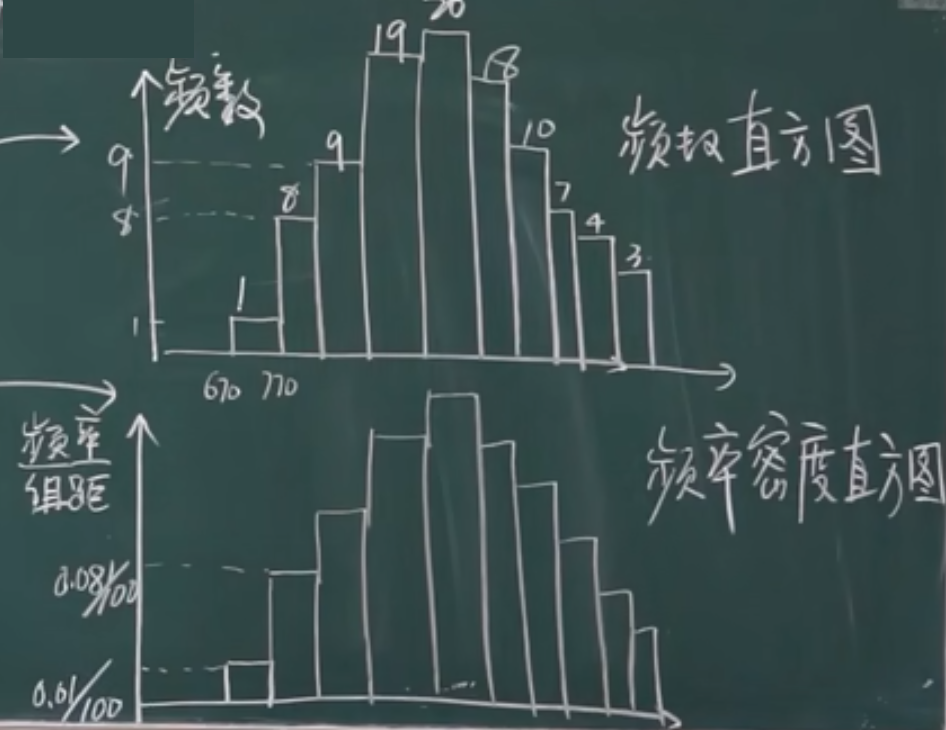

#### 概率密度函数

概率密度直方图的点相连近似一个光滑曲线，这条曲线的函数称作**概率密度函数**

表达方式$P\{a<x\le b\}=\int^b_af(x)\mathrm{d}x$，整个区间积分值为1

(1)f(x)始终会大于等于0(因为概率不能小于0)

(2)单独取到个别点的概率为0，因此区间左右端点无所谓，也即$P\{a\le x\le b\}=P\{a<x\le b\}=P\{a\le x<b\}=P\{a<x<b\}$

后者例子:扔到(0,1)概率确实是1，因为两侧端点概率为0，但是在可以出现在端点的情况

当区间是($-\infin,+\infin$)时，趋近于无穷的值为0，收敛，整体值为1

而某点积分因为$\Delta x\rightarrow 0$，所以积分值为0。

如果要求某点概率密度函数值可以对该点求导

$\lim_{\Delta x\rightarrow 0}\frac{P\{x<x+\Delta x\}}{\Delta x}=\underbrace{\lim_{\Delta x\rightarrow 0}\frac{\int^{x+\Delta x}_x f(x)\mathrm{d}x}{\Delta x}}_{洛必达} =f(x)$

将分母移过去就可以知道这每个小块的面积就是近似概率

### 分布函数

$F(x)=P(X\le x)=\int^x_{-\infin}f(x)\mathrm{d}x$，分布函数，代表的是积分值

#### 分布函数性质

(1)$x\in (-\infin,+\infin),F(x)\in[0,1]$

(2)$F(x)$不减(单调递增)，因为这是概率密度函数的积分，而概率密度函数永远大于0

(3)$F(x)$若离散则右连续，最多有可列个间断点

点的概率会影响$F(x)$的值，例如，x=0，概率大小为0.5，在(x-0)，即左极限时，$F(x)$=0；在(x+0)，即右极限时，包括了x=0，$F(x)$=0+0.5=0.5

(简单说就是左侧还没有包含这个点)

[为什么概率分布函数是右连续？](https://www.bilibili.com/read/cv2956555)

因此可以推出离散型概率分布函数一定是右连续

$F\{X\le x\}=P\{X<x\}+P\{X=x\}$

#### 分布函数重点

##### 间断点取值

间断点$x_k$是$x$的取值，比如$P\{x=x_p\}=F(x_k)-F(x_k-0)$

##### 常用**求参数**式子

$$
\lim_{x\rightarrow +\infin}F(x)=F(+\infin)=1\\
\lim_{x\rightarrow -\infin}F(x)=F(-\infin)=0
$$

因为是从$-\infin$开始的积分值，所以前者是整体概率，后者概率是0

##### 绘制概率表时要从小到大排序

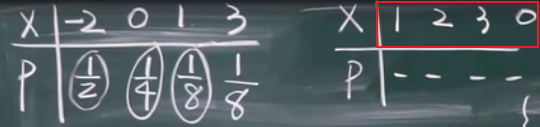

注意，概率图(分布图)只增不减，概率是两段之间的高度，形式如下，以>3为例就是说当x>3时F(X)=f(X < x)的值，所以包含全部，概率为1(包含端点才算在结果里)

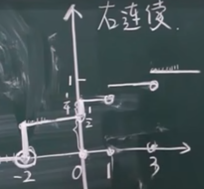

##### 分段函数

如果求x < a的积分值，只直到分割出的几段积分，需要将前面每一段的积分值都累加起来

比如$2\le x,F(x)=\int^0_{-\infin}0\mathrm{d}x+\int^2_0x\mathrm{d}x+\int^x_2x\mathrm{d}x$

特殊例子

$$
\begin{aligned}
&F(x)=\begin{cases}
    0,x<0\\
    Ax^2,0\le x<1\\
    1,1\le x
\end{cases}\\
&那么有\begin{cases}
    F(-\infin)=0\\
    F(+\infin)=1\\
    \lim_{x\rightarrow 0^+}F(x)=0\\
    \lim_{x\rightarrow 1^-}Ax^2=A=F(1)=1
\end{cases}
\end{aligned}
$$

##### 指数函数无记忆性

$$
\begin{aligned}
&P\{x>5+t|x>5\}\\
&=\frac{P\{\{x>5+t\}\cap \{x>5\}\}}{P\{x>5\}}\\
&=\frac{P\{x>5+t\}}{P\{x>5\}}\\
&=\frac{1-F(5+t)}{1-F(5)}\qquad (指数函数有无记忆性)\\
&=e^{-\lambda t}=P\{X>t\}\qquad (无记忆性，与已发生无关)
\end{aligned}
$$

大的发生了，小的一定发生，上面的条件就是x>5已经发生，因此分子可以去掉x>5的部分

可以使用下式进行替换从而利用无记忆性

$$
P\{X\le 6|X>3\}=1-P\{X<6|X<3\}
$$

---

### 常见分布

离散称作分布律，连续称作分布函数

#### 0-1分布(二项的特例)

只有两个结果，且为0或1，只做一次(一般让x=1为p)

$P\{x=k\}=(1-p)^{1-k}p^k,k=0,1$

#### 二项分布

只有两种结果，可不为0或1，n次实验发生k次(一般让x=1为p)

$\{x=k\}=C^k_np^k(1-p)^{n-k},k=0,1,2,\cdots,n$

写作$X\sim B(n,p)$(小b也可以)

n偶数时最大值在n/2处取得，当n为奇数时最大值在n/2，n＋1/2处同时取得

例子:每个床维修可能0.01，那么一个人看20台不及时修理的可能，也就是同时坏了超过1台的情况

$P\{x>1\}=1-P\{x=0\}-P\{x=1\}=1-C^0_{20}0.99^{20}-C^1_20.99^{19}*0.01$

可用泊松分布算近似

#### 几何分布

第k次首次发生，前k-1次未发生

$P\{x=k\}=(1-p)^{k-1}p,x\sim G(p)$

因为其累加和就是二项式$(a+b)^n$的值，而a+b=1，所以就是1

#### 泊松分布

$P\{x=k\}=\frac{\lambda^k}{k!}e^{-\lambda},\lambda>0,k=0,1,\cdots$

证明其概率和为1:

$$
1=e^{-\lambda}\sum_{k=0}^\infin \frac{\lambda^k}{k!}\\
\begin{aligned}
&\because e^x=1+x+\frac{x^2}{2!}+\cdots+\frac{x^k}{k!}\\
&\therefore 1=e^{-\lambda}\cdot e^\lambda
\end{aligned}
$$

写作$X\sim P(\lambda)$(P也可以写成$\pi$)

一般是查表因为较难计算

**使用情景**:当二项分布的n比较大，p比较小(小概率事件)，np适中，一般考虑为$n\ge 100,np\le 10$

一般要认为$np=\lambda$，有$\lim_{n\rightarrow\infin} C^k_np^k_n(1-p)^k=\frac{\lambda^ke^{-\lambda}}{k!}$

证明:

$$
\begin{aligned}
\lim_{n\rightarrow\infin} C^k_np^k_n(1-p)^k&=\frac{n(n-1)\cdots(n-k+1)}{k!}(\frac{\lambda}{n})^k(1-\frac{\lambda}{n})^{n-k}\\
&=\frac{\lambda^k}{k!}\lim e^{(n-\lambda)\ln(1-\frac{k}{n})}\\
&=\frac{\lambda^k}{k!}e^{\lim(n-\lambda)(\underset{\ln (1+x)\sim x}{-\frac{\lambda}{n}})}\\
&=\frac{\lambda^k}{k!}e^{-\lambda}\qquad (\lim_{n\rightarrow \infin}\frac{\lambda^2-n\lambda}{n}=-\lambda)
\end{aligned}
$$

#### 超几何分布

$N$个元素，其中$N_1$个是第一类，$N_2$个是第二类，取n个，X:n个属于第一/二类

$P\{x=k\}=\frac{C^k_{N_1}C^{n-k}_{N_2}}{C^n_N},k=0,1,\cdots,min\{n,M\}$

#### 均匀分布

用于连续型，写作U(a,b)

$$
f(x)=\begin{cases}
    \frac{1}{b-a},a\le x\le b\\
    0,else
\end{cases}\\
X\sim U[a,b]
$$

其中a,b是区间左右端点

连续型概率密度函数曲线下方的面积是概率，因为总体概率是1，所以b-a是长，那么$\frac{1}{b-a}$就是高

$$
P\{c<x<d\}=\frac{d-c}{b-a}
$$

函数图像是一条只增加的曲线，越往右，占据面积越大，越可能在里面所以只增加

#### 指数分布

写作E($\lambda$)，有时会是$\theta=1/\lambda$

$$
f(x)=\begin{cases}
    \lambda e^{-\lambda x},x>0\\
    0,x\le 0
\end{cases}\\
\lambda>0,X\sim Exp(\lambda)
$$

证明方法:

$$
f(x)=be^{-ax}\\
1=\int f(x)\mathrm{d}x=-\frac{b}{a}e^{-ax}|^{+\infin}_0=\frac{b}{a}
$$

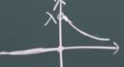

分布函数

$$
\begin{aligned}
F(x)&=\int^x_0 \lambda e^{-\lambda t}\mathrm{d}t\\
    &=-\int^x_0 e^{-\lambda t}\mathrm{d}(-\lambda t)\\
    &=-e^{-\lambda t}|^x_0\\
    &=1-e^{-\lambda x}
\end{aligned}
$$

适合计算包含问题，因为可以将除法改为加减

#### 正态分布

$$
\Phi(x)=\frac{1}{\sqrt{2\pi}\sigma}e^{-\frac{(x-\mu)^2}{2\sigma^2}},-\infin<x<+\infin\\
X\sim N(\mu,\sigma^2)
$$

$\sigma^2$是方差

通过这个式子可以求$\pi$

$$
\frac{1}{\sqrt{2\pi}\sigma}\int^{+\infin}_{-\infin}e^{-\frac{(x-\mu)^2}{2\sigma^2}}\mathrm{d}x\\
\begin{aligned}
&=\frac{\sqrt{2}\sigma}{\sqrt{2\pi\sigma}}\int^{+\infin}_{-\infin}e^{-(\frac{x-\mu}{\sqrt{2}\sigma})^2}\mathrm{d}(\frac{x-\mu}{\sqrt{2}\sigma})\\
&=\frac{1}{\sqrt{\pi}}x=1=>x=\sqrt{\pi}\\
x&=\int^{+\infin}_{-\infin}e^{-x^2}\mathrm{d}x=\sqrt{\pi}
\end{aligned}\\
$$

证明概率和为1

$$
\begin{aligned}
let \frac{x-\mu}{\sigma}&=t,\mathrm{d}x=\sigma\mathrm{d}t\\
\int f(x)\mathrm{d}x&=\int \frac{1}{\sqrt{2\pi}}e^{-\frac{t^2}{2}}\mathrm{d}t=l\\
l^2&=\frac{1}{2\pi}\int \int e^{-(t^2+u^2)/2}\mathrm{d}t\mathrm{d}u\\
(相乘的另外一个函数&的取值独立于t因此命名为u)\\
&=\frac{1}{2\pi}\int^{2\pi}_0 \mathrm{d}\theta\int^{2\pi}_0 e^{-(r^2)/2}r\mathrm{d}r\\
&=\int^{\infin}_0 -e^{-(r^2)/2}\mathrm{d}(-\frac{r^2}{2})\\
&=-e^{-(r^2)/2}|^{+\infin}_0\\
&=0+1=1
\end{aligned}
$$

[证明过程](https://qb.zuoyebang.com/xfe-question/question/14a52b032e1e352b4fa72f691c0abb2a.html)

##### 正态分布性质

(1)$x=\mu$是对称轴，且此时有最大值

(2)以$x$轴为渐近线，$x=\mu\pm \sigma$是拐点

(3)$\sigma$固定，$\mu$变化，图像左右移动。$\mu$固定，$\sigma$变化，若变小则最高点上移(变陡)，反之下移(变缓)

##### 对数正态分布

比如新冠潜伏期符合

$$
\begin{aligned}
&\ln Y~N(\mu,\sigma^2)\\
&let\quad X=\ln Y,Y=e^X\\
&f_X(x)=\frac{1}{\sqrt{2\pi}\sigma}e^{-\frac{(x-\mu)^2}{\sigma^2}},x\in R\\
&=f_Y(y)=\frac{1}{\sqrt{2\pi}\sigma y}e^{-\frac{(\ln y-
\mu)^2}{\sigma^2}},y>0
\end{aligned}
$$

一般对数正态分布在<7时有90%，但选择14天为了更好保障

##### 标准正态分布

$\mu=0,\sigma=1$，写作$N(0,1)$，概率密度为$\phi(x)=\frac{1}{2\pi}e^{-t^2/2}$，分布则在系数后求$\int^x_{-\infin}$

$\Phi(x)其实是指在x前的概率，而标准正态分布对称，于是有以下性质$

性质:y轴对称，偶函数

$\Phi_0(-x)=1-\Phi_0(x)$

这里也可以用于转换取值比如$P\{x\le \frac{x-b}{k}\}=1-P\{x<\frac{x-b}{k}\}$

**重要**:密度函数标准与一般正态分布的关系

$$
\phi(x)=\frac{1}{\sigma}\phi_0(\frac{x-\mu}{\sigma})
$$

可以通过一般正态分布做等价变换得到，注意，分布函数不需要$\frac{1}{\sigma}$

题目一般要求化为标准形式

对于X/Y对应的函数，以下列方式表达$P\{Y\le 2x\}=F_Y(x)$

有时要同乘或同除以得到与X有映射关系的Y的分布$N(\mu,\sigma)$后

假设题目给出$Y=ax+b$，并且通过万能公式让$Y=\frac{X-\mu}{\sigma}$，可以得知$\frac{1}{\sigma}=a$

例子:$X\~N(a,\sigma^2),P\{x\le a-\sigma^2\}=>P\{\frac{x-a}{\sigma^2}\le \frac{-\sigma^2}{\sigma}\}=\Phi(-\sigma)$

新的$\mu$只需要将原本$x=\mu$代入Y的式子就可以得到，相当于对原本的值进行映射

#### 柯西分布

$$
\begin{aligned}
f(x)&=\frac{\pi}{1+x^2},(-\infin<x<\infin)\\
F(x)&=\int f(x)\mathrm{d}x=\frac{1}{\pi}\cdot \arctan x|^{+\infin}_{-\infin}\\
&=\frac{1}{\pi}(\arctan x+\frac{\pi}{2})=\frac{1}{2}+\frac{1}{\pi}\arctan x
\end{aligned}
$$

### 上$\alpha$分位点

设$X~N(0,1)$若$z_\alpha$满足

$$
P\{X>z_\alpha\}=\alpha,0<\alpha<1
$$

则$z_\alpha$叫做标准正态分布的**上$\alpha$分位点**

给一个概率得对应的点，有表可查

同时有$z_{1-\alpha}=-z_\alpha$

$\Phi(z_\alpha)=1-\alpha$

### 万能公式和万能方法

必须单调

$$
\begin{aligned}
&F_Y(y)=P\{Y\le y\}=P\{2X+8\le y\}=P\{X\le \frac{y-8}{2}\}=F_X(\frac{y-8}{2})\\
&f_Y(y)=\frac{1}{2}f_x(\frac{y-8}{2})\qquad (由y=2x+8得到y的取值范围)\\
&X=h(y)\\
&F_Y(y)=P\{X\le h(y)\}=F_X(h(y))\\
&f_Y(y)=f_X(h(y))\cdot h'(y)
\end{aligned}
$$

---

## 多维随机变量

### 二维分布

用一个帽型表示，分布函数:$F(x,y)=P\{X\le x,Y\le y\}$称作随机变量X和Y的联合分布(二维随机变量(X,Y)的分布函数)

性质:

(1)二维概率不是线段而是面积

(2)$F(x,y)不减$

(3)$F(-\infin,y)=0,F(-\infin,x)=0,F(-\infin,-\infin)=0,F(\infin,\infin)=1$

(4)$F(x,y)$关于(分别)x和y轴对称

(5)离散型右连续

(6)$x_1<x_2,y_1<y_2,P\{x_1<Y<x_2,y_1<Y<y_2\}=F(x_2,y_2)-F(x_2,y_1)-F(x_1,y_2)+F(x_1,y_1)$

为何又加，根据下图理解

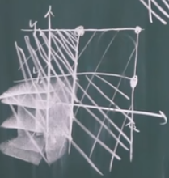

厚涂的位置被减两次，因此要加回一个

一维的概率放在二维里的实际意义

$$
\begin{aligned}
&F_X(x)=P\{X\le x\}=F(x,+\infin)=P\{X\le x,Y<+\infin\}\\
&F_Y(y)=P\{Y\le y\}=F(+\infin,y)=P\{X<+\infin,Y\le y\}
\end{aligned}
$$

整体体积为1也即$\sum_i\sum_jP_{ij}=1$

**重点**:假如只给了整数的概率，需要求小数的，直接在表格上作定位选择

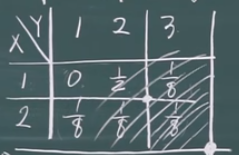

三维的情况下就以xyz三个坐标定位

**注意**:(1)联合分布可唯一确定边缘分布

(2)边缘分布不能确定联合分布(X,Y独立)

就相当于已知一条公式可以计算唯一一个结果，但是不能通过来反推这是某条公式计算得到的

---

### 二维连续型

#### 联合密度

(1)$f(x,y)>0$

(2)$\int^{+\infin}_{-\infin}\int^{+\infin}_{-\infin}f(x,y)\mathrm{d}x\mathrm{d}y=1$

(3)$\frac{\partial^2F(x,y)}{\partial x\partial y}=f(x,y)$

(4)$G:XY$平面上的一个区域，$P\{(X,Y)\in G\}=\iint_Gf(x,y)\mathrm{d}x\mathrm{d}y$

例子:

$$
\begin{aligned}
&f(x,y)=\begin{cases}
    C,(x,y)\in G\\
    0,else
\end{cases}\\
&G:x^2+y^2\le r^2\\
&\int^{+\infin}_{-\infin}\int^{+\infin}_{-\infin}f(x,y)\mathrm{d}x\mathrm{d}y\\
&=\iint_G C \mathrm{d}x\mathrm{d}y=C\pi r^2=1\\
&C=\frac{1}{\pi r^2}
\end{aligned}
$$

下图为其密度函数图，是均匀分布，三维情况下是1/面积

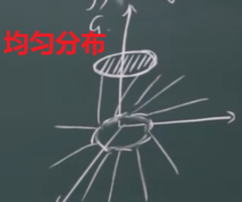

其中，在中间这一圆内的函数值都是C，而外面都是0，因为是小于等于，所以这个是C的圆的边缘是实的

特殊技巧:假如f(x,y)是自然对数相关的函数，那么其积分可以直接拆开成f(x)*f(y)，因为变量独立时密度、分布函数都有自然对数因此可以直接相乘

#### 边缘密度和分布

做题时记得**画图**

联合分布可推边缘分布，反之不可，可靠独立性条件等反推

对帽型做一条切线，然后让这个切线放在二维坐标轴内，那么这个曲线就是边缘密度曲线

这个曲线是二元函数，而其下的面积就是对应轴的概率

表达方式:$f_X(x)=\int^{+\infin}_{-\infin}f(x,y)\mathrm{d}y=F'(x,+\infin)=F_X'(x)$(求积分上下限是该变量的公式，范围根据函数图像的取值，有大取大，还要分类讨论是否有交集，上下是否有变)

而**边缘分布律**可写$p_{i\huge· }=\sum_{i=1} p_{ij}$(j的就置换ij位置)

**重点**:因为要仅留x的方向，所以导的是y，而且上下限要是y=f(x)(类比x型y型)

例子:

$$
\begin{aligned}
&f(x)=\begin{cases}
    \frac{1}{\pi r^2},x^2+y^2=r^2\\
    0,else
\end{cases}\\
&当|x|\le r,f_X(x)=\int^{+\infin}_{-\infin}f(x,y)\mathrm{d}y&=\int^{\sqrt{r^2-x^2}}_{-\sqrt{r^2-x^2}}\frac{1}{\pi r^2}\mathrm{d}y\\
&当|x|>r,f_X(x)=0\\
&反之f_Y(y)就是求y的取值的积分
\end{aligned}
$$

---

### 条件分布

$$
F(x|A)=P\{X\le x|A\}
$$

#### 离散型随机变量的条件分布

$P\{X=x_i|Y=y_j\}=\frac{P_ij}{P^{(2)}_j}$

比如$x_1,x_2$构成的2x2表格，将每行每列的总和写出，然后当$x_1=0$时，有$P\{x_2=0|x_1=0\},P\{x_2=1|x_1=0\}$

下图为$x_1$的情况，$x_2$同理

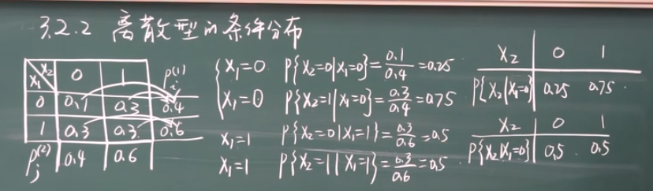

#### 连续型随机变量的条件分布

$$
\begin{aligned}
&F(x|y)=\int^x_{-\infin}\frac{f(u,y)}{f_Y(y)}\mathrm{d}u\\
&F(y|x)=\int^y_{-\infin}\frac{f(x,v)}{f_X(x)}\mathrm{d}v\\
&f(x|y)=\frac{f(x,y)}{f_Y(y)}\\
&f(y|x)=\frac{f(x,y)}{f_Y(x)}\\
\end{aligned}
$$

例子:

$$
\begin{aligned}
&f(x,y)=\begin{cases}
    \frac{1}{\pi r^2},x^2+y^2\le r^2\\
    0,else
\end{cases}\\
&f_X(x)=\begin{cases}
    \frac{2\sqrt{r^2-x^2}}{\pi r^2},|x|\le r\\
    0,else
\end{cases}\\
&f_Y(y)=\begin{cases}
    \frac{2\sqrt{r^2-y^2}}{\pi r^2},|x|\le r\\
    0,else
\end{cases}\\
&求P\{X>0|Y=0\}\\
&|y|<r,f(x|y)=\frac{f(x,y)}{f_Y(y)}=\begin{cases}
    \frac{1}{2\sqrt{r^2-x^2}},-\sqrt{r^2-y^2}\le x\le \sqrt{r^2-y^2}\\
    0,else
\end{cases}\\
&P\{X>0|Y=0\}=\int^r_0\frac{1}{2r}\mathrm{d}x=\frac{1}{2}\\
&这里Y=0,y=0,代入公式
\end{aligned}
$$

$$
P\{X\le x|Y=y\}=\lim_{\epsilon\rightarrow 0}\frac{P\{X\le x,y\le Y\le y+\epsilon\}}{P\{y\le Y\le y+\epsilon\}}\\
\begin{aligned}
    &=\lim_{\epsilon\rightarrow 0}\frac{\int^x_{-\infin}f(u,v)\mathrm{d}v\mathrm{d}u}{\frac{1}{\epsilon}\int^{y+\epsilon}_yf_Y(v)\mathrm{d}v}\\
    &=\frac{\int^x_{-\infin}f(u,v)\mathrm{d}u}{f_Y(y)}\\
    &=\int^x_{-\infin}\frac{f(u,v)}{f_Y(y)}\mathrm{d}u
\end{aligned}
$$

上面利用了积分中值定理

$$
\begin{aligned}
&\int^b_af(x)\mathrm{d}x=f(\xi)(b-a)\\
&\int^{y+\epsilon}_yf_Y(v)\mathrm{d}v=f_Y(\xi)\epsilon,\xi \in(y,y+\epsilon)\\
&b-a就是\epsilon\\
&\frac{1}{\epsilon}\int^{y+\epsilon}_yf_Y(v)\mathrm{d}v=f_Y(\xi)=f_Y(y)
\end{aligned}
$$

---

### 随机变量的独立性

$$
\begin{aligned}
&f(x|y)=f_X(x)=\frac{f(x,y)}{f_Y(y)}\\
&f(x,y)=f_X(x)f_Y(y)\\
&F(x,y)=F_X(x)F_Y(y)\\
&P\{X\in S_x,Y\in S_y\}\\
\end{aligned}
$$

离散型独立性

$
P\{X=x_y,Y=y_j\}=P\{X=x_i\}P\{Y=y_j\}
$

连续型独立性

$$
f(x,y)=f_X(x)f_Y(y)\\
F(x,y)=F_X(x)F_Y(y)
$$

定理:若$X,Y$独立，$g_1(X),g_2(Y)$是独立，$X^2,Y^2,a_1X+b_1,a_2Y+b_2$独立

拓展1:若一组随机变量相互独立，其中k个随机变量也相互独立

拓展2:若一组随机变量相互独立，则任意两组相互独立

拓展3:若两组随机变量相互独立，满足h,g连续函数的h(组1),g(组2)相互独立

---

### 二维离散型分布

$$
\begin{aligned}
    x_1&|&0&|&1\\
    P&|&1-p&|&p
\end{aligned}\\
\begin{aligned}
    x_2&|&0&|&1\\
    P&|&1-p&|&p
\end{aligned}\\
$$

---

$$
\begin{aligned}
    x_1+x_2&|&0&|&1&|&1&|&2\\
    P&|&(1-p)^2&|&(1-p)p&|&p(1-p)&|&p^2
\end{aligned}
$$

例子:泊松分布

$$
\begin{aligned}
&X,Y独立,\lambda_1,\lambda_2泊松分布,Z=X+Y\\
&P\{X=k\}=\frac{\lambda^k}{k!}e^{-\lambda}\\
&K是Z的取值，K=0,1,2\cdots
表示它是离散的不是连续的\\
&Z=X+Y=K所以把Z=K表示为\{X=i,Y=K-i\}\\
&\begin{aligned}
P\{Z=k\}&=\sum^k_{i=0}\{x=i,Y=k-i\}\\
&=\sum^k_{i=0}P\{X=i\}P\{Y=k-i\}\\
&=\sum^k_{i=0}\frac{\lambda^i_1}{i^1_1}e^{-\lambda}\frac{\lambda^{k-i}_2}{(k-i)!}e^{\lambda_2}=\frac{(\lambda_1+\lambda_2)^2}{k!}e^{-(\lambda_1+\lambda_2)}
\end{aligned}\\
&C^i_k=\frac{k!}{i!(k-i)!}\\
&\frac{1}{i!(k-i)!}＝\frac{C^i_k}{k!}\\
&C^i_k\lambda_1^i\lambda_2^{k-i}是(\lambda_1+\lambda_2)^k的二项展开项\\
&补充:\sum^k_{i=0}\frac{C^i_k\lambda_1^i\lambda_2^{k-i}}{k!}是卷积\\
&c_n=\sum_{i\circ j=k}a_ib_j,\circ指任意运算
\end{aligned}
$$

---

### 二维连续分布

$$
\begin{aligned}
&F_Z(\xi)=P\{Z\le \xi\}=P\{g(X,Y)\le\xi\}\\
&=\iint_{D_\xi}f(x,y)\mathrm{d}x\mathrm{d}y\\
&D_\xi=\{(x,y)|g(x,y)\le\xi\}\\
&Z=\sqrt{X^2+Y^2}\\
&P\{Z\le\xi\}=P\{\sqrt{X^2+Y^2}\le\xi\}\\
\end{aligned}
$$

但是，Z仍然是一维的，不过其值是由二维的得到

计算时会常用到二重积分，极坐标形式记得带上r，还要经常换元$z=x+y=k=>y=k-x$

**正态分布的再生性**

$$
Z=X+Y,\\
X\sim N(\mu_1,\sigma_1^2),Y\sim N(\mu_2,\sigma_2^2)\\
X+Y\sim N(\mu_1+\mu_2,\sigma_1^2+\sigma_2^2)
$$

(1)正态随机变量的线性函数仍为正态随机变量。

(2)正态随机变量的线性组合仍为正态随机变量。

(3)正态随机变量的乘积仍为正态随机变量。

[两个高斯分布的和的分布——正态分布的再生性](https://www.cnblogs.com/rainbow70626/p/14070413.html)

注意:如果函数M是Max/Min有关，那么需要仔细观察元素区间并确定最终值

二维正态分布:$(X,Y)~N(\mu_1,\mu_2,\sigma_1^2,\sigma_2^2,\rho),(\sigma_1,\sigma_2>0,-1<\rho<1)$

$$
f(x,y)=\frac{1}{2\pi \sigma_1\sigma_2\sqrt{1-\rho^2}}e^{\frac{-1}{1-\rho^2}[\frac{(x-\mu_1)^2}{\sigma_1^2}-2\rho \frac{(x-\mu_1)(y-\mu_2)}{\sigma_1\sigma_2}+\frac{(y-\mu_2)^2}{\sigma_2^2}]}
$$

求边缘的方法是让里面的项尽量变为平方项然后替换，最后发现$\rho$不见了，而边缘分布的式子和普通正态分布一致(除了变量改变)，而这个$\rho$是**相关系数**体现x与y的关系

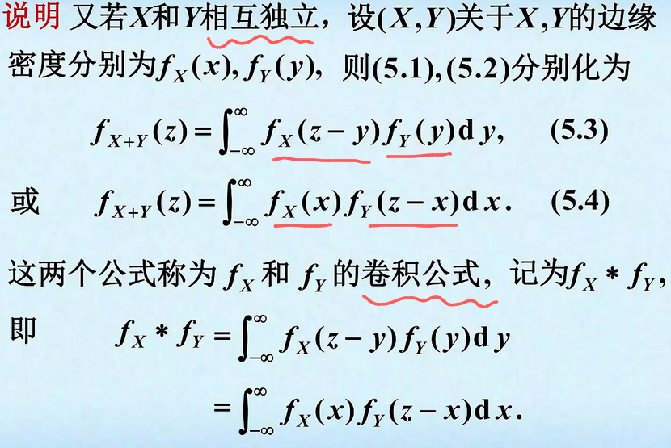

---

## 数学期望

### 平均

平均数:$180,190,200平均190$

加权平均:$90*0.9+100*0.1=91$

---

### 期望

连续离散化，各个区间的概率，如果有多个独立变量，相互之间的概率要算交集

比如一车8~9点必到，二车9~10点必到，在8:10~9:10中坐到9:10的车需要让一车到又二车到(相乘)的概率

让E(x)=f(x)变为E(g(x))=f(g(x))就可以进行变量替换

如果是复合情况求单独变量的期望，可以通过边缘密度函数来求该变量的期望，也可以用连续复合的公式比如$EY=\int \int yf(x,y)\mathrm{d}y\mathrm{d}x$就是让Y=y=g(x,y)

#### 离散期望

$$
P(X=x_k)=P_k,若\sum^\infin_{k=1}x_kP_k绝对收敛\\
EX=\sum_{k=1}x_kP_k
$$

#### 连续期望

$$
P_k=\int^{+\infin}_{-\infin}xf(x)\mathrm{d}x绝对收敛\\
EX=\sum_{k=1}\int^{+\infin}_{-\infin}\underbrace{x}_{取值}\underbrace{f(x)}_{概率}\mathrm{d}x
$$

#### 随机变量函数的期望

$$
\begin{aligned}
&离散情况\\
&EX=1.2,Y=4X+1,EY=E(4X+1)\\
&连续情况\\
&EY=\int (4X+1)f(x)\mathrm{d}x\\
&复合情况\\
&EY=\int g(x)f(x)\mathrm{d}x\\
&二维情况\\
&Z=X^2-Y,\\
&EZ=(x_1^2-y_1)*P_{11}+(x_1^2-y_2)*P_{12}+\cdots\\
&EZ=\sum_i\sum_j g(x_i,y_j)P_{ij}\\
&EZ=\int \int g(x,y)f(x,y)\mathrm{d}x\mathrm{d}y
\end{aligned}
$$

---

### 期望的性质

(1)EC=C,C*1=C

(2)E(X+C)=EX+C

连续情况下证明:

$$
E(X+C)=\int(x+C)f(x)\mathrm{d}x\\
=\int xf(x)\mathrm{d}x+C\int f(x)\mathrm{d}x
$$

因为总概率为1，所以后面就是C

(3)E(CX)=CEX

(4)E(kX+b)=kEX+b

(5)E(X$\pm$Y)=EX$\pm$EY

$$
E(\sum C_iX_i)=\sum C_iEX_i\\
E(\frac{1}{n}\sum X_i)=\frac{1}{n}\sum EX_i\\
E(2X_1-3X_2)=2EX_1-3EX_2
$$

证明:

$$
E(X\pm Y)=\int\int (x\pm y)f(x,y)\mathrm{d}x\mathrm{d}y\\
\begin{aligned}
&=\int\int xf(x,y)\mathrm{d}\mathrm{d}y\pm\int\int yf(x,y)\mathrm{d}\mathrm{d}y\\
&=\int x\mathrm{d}x[\int f(x,y)\mathrm{d}y]\pm \int y\mathrm{d}y[\int f(x,y)\mathrm{d}x]\\
&=E(X)\pm E(Y)
\end{aligned}
$$

(6)X,Y独立,E(XY)=EX*EY

证明方法就是将$\int\int$形式拆成$\int * \int$形式

特殊例子:N产品，M次品，取n件，求次品期望

$$
次品1\sim M,X_i=\begin{cases}
    1,i号次品被抽中\\
    0,i号次品未被抽
\end{cases}\\
X=X_1+X_2+\cdots,要么0要么1\\
P\{X_i=1\}=\frac{n}{N}\\因为抽n件，所以每件次品(即使不是次品也是)被抽中的概率是\frac{n}{N}\\
P\{X_i=0\}=1-\frac{n}{N}\\
EX_i=\frac{n}{N},EX=EX_i+\cdots=\frac{nM}{N}
$$

### 条件期望

一个变量取某值，另外一个变量的期望

(1)离散

$$
E(X|Y=y_i)=\sum x_iP(X=x_i|Y=y_i)\\
E(Y|X=x_i)=\sum x_iP(Y=y_i|X=y_i)\\
\begin{aligned}
X/Y&|&1&|&2&|&3\\
0&|&0.1&|&0.2&|&0.3\\
1&|&0.2&|&0.1&|&0.1&|&0.4
\end{aligned}\\
\begin{aligned}
Y&|&1&|&2&3\\
P(Y|X=1)&|&0.5&|&0.25&|&0.25
\end{aligned}\\
比如0.5=0.2/0.4=P_{y_1}/P_x，因为x已经发生了\\
$$

---

## 方差

偏差程度

$DX=E[(X-EX)^2]$(实际书写不用方括号)

**特殊公式**:

$$
\begin{aligned}
DX&=E(X^2)-(EX)^2\\
E(X^2-2XEX+(EX)^2)&=EX^2-2EXEX+(EX)^2\\
&=EX^2-(EX)^2
\end{aligned}
$$

EX是常数，在期望里常数不变所以E(EX)=EX，但E(XEX)就是EXEX

$\sqrt{DX}$标准差(均方差)

(1)离散:$DX=\sum_k(x_k-EX)^2P_k$

(2)连续:$DX=\int^{+\infin}_{-\infin}(x-EX)^2f(x)\mathrm{d}x$

结合方差公式出的题型会有给出一个函数，知道期望和方差，求函数里面的变量值

如果是3个变量，最后方差2个方差期望值本身一个方程用增广矩阵求

---

### 方差性质

(1)$DC=0$

(2)$D(X+C)=DX$

(3)$D(CX)=C^2DX$

(4)$D(kX+b)=k^2DX$

(5)X,Y独立,$D(X\pm Y)=DX+DY$

(6)$C_1X_1+\cdots+C_nX_n\sim N(\sum C_i\mu_i,\sum C_i^2\sigma_i^2)$

若各项独立则可以拓展到n项

证明:

$$
D(X\pm Y)=E(X\pm Y-E(X\pm Y)^2)\\
\begin{aligned}
&=E(X\pm Y-EX\mp EY)^2\\
&=E[(X-EX)\pm(Y-EY)^2]\\
&=E[(X-EX)^2\pm 2(X-EX)(Y-Ey)^2]\\
&=E(X-EX)^2+E(Y-EY)^2\\
&\pm \underbrace{2E[(X-EX)(Y-EY)]}_{E(XY-XEY-YEX+EXEY)}\\
&=DX+DY\pm(EXEY-EYEX-EXEY+EXEY)(后面四项消掉)\\
&=DX+DY
\end{aligned}
$$

(6)$DX=0<=>P(X=EX)=1$

特殊情况(标准真态分布):
$$
\begin{aligned}
X^*&=\frac{X-EX}{\sqrt{DX}}\\
EX^*&=0,DX^*=1\\
EX^*&=E(\frac{X-EX}{\sqrt{DX}})=\frac{1}{\sqrt{DX}}(EX-EX)=0\\
DX^*&=\frac{1}{DX}D(X-EX)=\frac{DX}{DX}=1\\
&对于方差，加常数结果不变
\end{aligned}
$$

### 离散分布的期望与方差

#### 0-1

$$
\begin{aligned}
P(X=k)&=p^k(1-p)^{1-k},k=0,1\\
EX&=p,EX^2=p\\
DX&=EX^2-(EX)^2=p(1-p)=pq
\end{aligned}
$$

#### 二项

$$
P(X=k)=C^k_np^kq^{n-k}\\
\begin{aligned}
&=\sum^n_{k=0}k*\frac{n!}{k!(n-k)!}p^kq^{n-k}\\
&=\sum^n_{k=1}\frac{n!}{(k-1)!(n-k)!}p^kq^{n-k}\\
&=np\sum^n_{k=1}\frac{(n-1)!}{(k-1)!(n-k)!}p^{k-1}q^{n-k}\\
&=np\underbrace{\sum^{n-1}_{k-1=0}C^{k-1}_{n-1}p^{k-1}q^{n-k}}_{(p+q)^n=1^n让k=k-1,n=n-1}\\
&=np
\end{aligned}\\
EX=np\\
EX^2=npq+n^2p^2\\
DX=npq
$$

#### 几何

$$
\begin{aligned}
\sum^\infin_{k=1}kx^{k-1}&=(\sum x^k)'=(\frac{x}{1-x})'=\frac{1}{1-x^2}\\
EX&=(\sum k(q-p)^{k-1}p)=\frac{1}{p^2}p=\frac{1}{p}\\
EX^2&=\underbrace{\sum k^2(1-p)^{k-1}}_{(\sum k x^k)'=(x\sum kx^{k-1})'=(\frac{x}{(1-x)^2})'=\frac{1+x}{(1-x)^3}}p=\frac{2-p}{p^2}\\
DX&=\frac{1-p}{p^2}
\end{aligned}
$$

#### 泊松

$$
\begin{aligned}
&P(X=k)=\frac{\lambda^k}{k!}e^{-\lambda},k=0,1,\cdots\\
&\begin{aligned}
EX&=\sum^\infin_{k=0}k\frac{\lambda^k}{k!}e^{-\lambda}\\
&=\sum^\infin
_{k=1}\frac{\lambda^k}{(k-1)!}e^{-\lambda}\\
&=\lambda \sum \frac{\lambda^{k-1}}{(k-1)!}e^{-\lambda}\\
&=\lambda \underbrace{\sum^\infin_{\underbrace{m=0}_{m=k-1}}\frac{\lambda^m}{m!}e^{-\lambda}}_{概率和为1}=\lambda
\end{aligned}\\
&\begin{aligned}
EX^2&=\sum^\infin_{k=0}k^2\frac{\lambda^k}{k!}e^{-\lambda}\\
&=\sum^\infin_{k=1}k\frac{\lambda^k}{(k-1)!}e^{-\lambda}\\
&=\sum \frac{(k-1)\lambda^k}{(k-1)!}e^{-\lambda}+\lambda\\
&=\lambda^2 \sum^\infin_{k=1}\frac{\lambda^{k-2}}{(k-2)!}e^{-\lambda}+\lambda=\lambda^2+\lambda
\end{aligned}\\
&DX=\lambda^2+\lambda-\lambda^2=\lambda
\end{aligned}
$$

---

### 连续分布的期望与方差

#### 均匀

$$
\begin{aligned}
f(x)&=\begin{cases}
\frac{1}{b-a},x\in[a,b]\\
0,else
\end{cases}\\
EX&=\int^b_a x\frac{1}{b-a}\mathrm{d}x=\frac{a+b}{2}\\
EX^2&=\int^b_a x^2\frac{1}{b-a}\mathrm{d}x=\frac{b^a+ab+a^2}{3}\\
DX&=\frac{b^2+ab+a^2}{3}-(\frac{a+b}{2})^2\\
&=\frac{(b-a)^2}{12}=\frac{长度^2}{12}\\
\end{aligned}
$$

#### 指数

$$
\begin{aligned}
f(x)&=\begin{cases}
\lambda e^{-\lambda x},x>0\\
0,else
\end{cases}\\
EX&=\int^{+\infin}_0 x\lambda e^{-\lambda x}\mathrm{d}x=-\int x\mathrm{d}e^{-\lambda x}\\
&=-xe^{-\lambda x}|^{+\infin}_0 + \int e^{-\lambda x}\mathrm{d}x=\frac{1}{\lambda}\\
凑-\lambda，然后积分&是无限减到0的，当为0时是1，所以最后是-1\\
EX^2&=\int x^2\lambda e^{-\lambda x}\mathrm{d}x\\
&=-\int x^2\mathrm{d}e^{-\lambda x}\\
&=-x^2e^{-\lambda x}|^{+\infin}_0+2\int e^{-\lambda x}x\mathrm{d} x=\frac{2}{\lambda
^2}\\
DX&=\frac{2}{\lambda^2}-(\frac{1}{\lambda})^2=\frac{1}{\lambda^2}
\end{aligned}\\
$$

#### 正态

$$
X\sim (\mu,\sigma^2)\\
\mu=EX,\sigma^2=DX\\
$$

标准

$$
Y=\frac{x-\mu}{\sigma}\sim N(0,1)\\
EY=0,DY=1\\
x=\sigma Y+\mu\\
EX=E(\sigma Y+\mu)=\sigma EY+\mu=\mu\\
DX=D(\sigma Y+\mu)=\sigma^2DY=\sigma^2
$$

---

### 分布期望方差表(要背)

$$
\begin{aligned}
分布&|&定义&|&EX&|&DX\\
0-1&|&P(X=k)=p^k(1-p)^{1-k},k=0,1&|&p&|&pq\\
二项&|&P(X=k)=C^k_np^kq^{n-k},k=0,1,\cdots&|&np&|&npq\\
几何&|&P(X=k)=(1-p)^{k-1}p,k=1,2,\cdots&|&\frac{1}{p}&|&\frac{1-p}{p^2}\\
泊松&|&P(X=k)=\frac{\lambda^k}{k!}e^{-\lambda},k=0,1,\cdots&|&\lambda&|&\lambda\\
均匀&|&f(x)=\begin{cases}
\frac{1}{b-a},x\in[a,b]\\
0,else
\end{cases}&|&\frac{a+b}{2}&|&\frac{(b-a)^2}{12}\\
指数&|&f(x)=\begin{cases}
\lambda e^{-\lambda x},x>0\\
0,else
\end{cases}&|&\frac{1}{\lambda}&|&\frac{1}{\lambda^2}\\
正态&|&X\sim (\mu,\sigma^2)&|&\mu&|&\sigma^2\\
标准&|&Y=\frac{x-\mu}{\sigma}\sim N(0,1)&|&0&|&1
\end{aligned}
$$

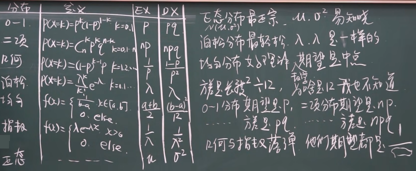

---

### 协方差

#### 定义

$$
\begin{aligned}
Cov(X,Y)&=E[(X-EX)(Y-EX)]\\
&=E(XY-XEY-YEX+EXEY)\\
&=E(XY)-EYEX-EXEY+EXEY\\
&=E(XY)-EXEY
\end{aligned}
$$

#### 同时发生的期望

##### 离散

$$
\begin{aligned}
E(XY)&=n_{x_1}p_{x_1}n_{y_1}p_{y_1}\\
&+n_{x_1}p_{x_1}n_{y_2}p_{y_2}+\cdots\\
&+n_{x_2}p_{x_2}n_{y_1}p_{y_1}+\cdots\\
\end{aligned}
$$

##### 连续

$$
E(XY)=\int^b_a \int^b_a f_X(x)f_y(y)\mathrm{d}x\mathrm{d}y\\
补充:f_X(x)=\int^{+\infin}_{-\infin}f(x,y)\mathrm{d}y
$$

#### 方差相加减公式

$$
D(X\pm Y)=DX+DY\pm 2Cov(X,Y)
$$

#### 协方差性质

(1)$Cov(X,Y)=Cov(Y,X)$

式子展开只是相乘顺序换了，一样

(2)$Cov(aX,bY)=abCov(X,y)$

期望内部乘常量可以提出

(3)$Cov(X_1+X_2,Y)=Cov(X_1,Y)+Cov(X_2,Y)$

$$
E[(X_1+X_2)Y]-E(X_1+X_2)EY\\
=E(X_1Y)+E(X_2Y)-EX_1EY-EX_2EY\\
=Cov(X_1,Y)+Cov(X_2,Y)
$$

(4)$Cov(C,X)=0$

$E(CX)-ECEX=CEX-CEX=0$

期望内是常数则期望是常数

(5)$X,Y$独立，$Cov(X,Y)=0$

$$
E(XY)=EXEY\\
Cov(X,Y)=E(XY)-EXEY=0
$$

#### 标准化随机变量以及相关系数推导

$$
X^*=\frac{X-EX}{\sqrt{DX}},Y^*=\frac{Y-EY}{\sqrt{DY}}\\
\begin{aligned}
Cov(X^*,Y^*)&=E(X^*Y^*)-EX^*EY^*\\
&=E[\frac{X-EX}{\sqrt{DX}}\frac{Y-EY}{\sqrt{DY}}]\\
&-E(\frac{X-EX}{\sqrt{DX}})E(\frac{Y-EY}{\sqrt{DY}})
\end{aligned}\\
\sqrt{DX}是常量可以提出，E(X-EX)=EX-E(EX)\\
EX也是常量所以=EX-EX=0\\
=\frac{E[(E-EX)(Y-EY)]}{\sqrt{DX}\sqrt{DY}}=\frac{Cov(X,Y)}{\sqrt{DX}\sqrt{DY}}=\rho(相关系数)
$$

---

### (线性)相关系数

$$
\rho=\frac{Cov(X,Y)}{\sqrt{DX}\sqrt{DY}}=\frac{E[(E-EX)(Y-EY)]}{\sqrt{DX}\sqrt{DY}}\\
$$

**关联性**:与Cov(X,Y)同正同负同0

#### 引理(柯西-施瓦茨不等式)

$$
|\rho|\le 1,[E(XY)]^2\le EX^2EY^2\\
$$

证:

$$
g(t)=E(tX-Y)^2=E(t^2X^2-2tXY+Y^2)\\
=t^2EX^2-2tE(XY)+EY^2\ge 0\\
\Delta=4[E(XY)]^2-4EX^2EY^2\le 0\\
(E(XY))^2\le EX^2EY^2
$$

#### 证明相关系数绝对值小于1

$$
\rho^2 \le 1\\
\rho^2=\frac{\{E[(X-EX)(Y-EY)]\}^2}{DXDY}\\
让X_1=X-EX,Y_1=Y-EY\\
DX=E[(X-EX)^2]=EX_1^2\\
=\frac{[E(X_1Y_1)^2]}{EX_1^2EY_1^2}\le 1\\
上面就是柯西-施瓦茨不等式
$$

#### 定理4.4:线性相关系数(不相关指线性)

$|\rho|=1<=>X与Y以p=1成线性关系，比如P(Y=aX+b)=1$

因此这个系数准确说是线性相关系数

$$
(1)\rho=1,X,Y完全正相关,Y=2X-3\\
(2)\rho=-1,完全负相关,Y=-0.5X+1\\
(3)|\rho|接近于0,线性关系弱\\
(4)\rho=0,不存在线性关系
$$

**重要**:若说X,Y不相关，一般指线性关系，若独立，则包括非线性关系

$$
独立<=>f(x,y)=f_X(x)f_Y(y)=\int\int xyf(x,y)\mathrm{d}x\mathrm{d}y=\int xf(x)\mathrm{d}x\int yf(y)\mathrm{d}y
$$

注意不是定积分，定积分求出常数，而不定积分求出函数，带上下限即使是无限也是定积分(反常)

---

### 中心距与原点距

#### 原点距

原点距:$EX^k$

期望又称**一阶原点距**

$$
\begin{cases}
(1)离散,\sum x^k_iP_i\\
(2)连续,\int^{+\infin}_{-\infin}x^kf(x)\mathrm{d}x
\end{cases}
$$

#### 中心距

中心距:$E(X-EX)^k$，以EX为中心

一阶中心距:$E(X-EX)=EX-EX=0$

二阶中心距:$E(X-EX)^2$

方差又称**二阶中心距**

$$
\begin{cases}
(1)离散,\sum (x_i-EX)^kP_i\\
(2)连续,\int^{+\infin}_{-\infin}(x-EX)^kf(x)\mathrm{d}x
\end{cases}
$$

**注意**:高于4阶极少使用

---

## 大数定律

大量重复实验的平均结果的稳定性

### 切比雪夫不等式

定理:$EX和DX存在，\forall \epsilon>0$

$\underbrace{P(|X-EX|\ge \epsilon)}_{落在外面的期望}\le \frac{DX}{\epsilon^2}$

给定一段距离，落在外面的期望小于一定值

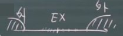

证明:
$$
X连续，左边=\int f(x)\mathrm{d}x\le \int \frac{(X-EX)^2}{\epsilon^2}f(x)\mathrm{d}x\\
\le \int^{+\infin}_{-\infin}\frac{(X-EX)^2}{\epsilon^2}f(x)\mathrm{d}x\\
判断理由:左侧都是平方，f(x)恒>0，所以积分区域增大值增大\\
=\frac{1}{\epsilon^2}\int^{+\infin}_{-\infin}(X-EX)^2f(x)\mathrm{d}x=\frac{DX}{\epsilon^2}
$$

DX越小波动越小，所以就更加紧密地在EX的区域内徘徊，落在外面概率就小

$\epsilon$越大，落外面的概率越小，反之越大

使用例子:

$$
X\sim N(\mu,\sigma^2)(或者任意给出标准差和平均值的分布)\\
P\{|x-\mu|\ge 3\sigma\}就是与平均相距3个标准差概率，若小于给定值则合理
$$

---

### 切比雪夫大数定律

根据频率收敛判断概率收敛

$$
\forall \epsilon>0,\exist N>0,n>N时,\\
频率\rightarrow 概率\\
P\{|x_n-a|<\epsilon\}=1\\
\lim_{n\rightarrow\infin}P\{|X_n-a|<\epsilon\}=1
$$

$$
若x_i之间不相关，Ex_i和Dx_i都存在，方差有异但\ge M，\forall \epsilon>0\\
\lim_{n\rightarrow\infin}P\{|\underbrace{\frac{1}{n}\sum x_i}_{均值}-\underbrace{\frac{1}{n}\sum EX_i|}_{期望均值}<\epsilon\}=1
$$

证明:

$$
x_i之间各不相关,Cov(x_i,x_j)=0
E(\frac{1}{n}\sum x_i)=\frac{1}{n}\sum Ex_i\\
D(\frac{1}{n}\sum x_i)=\frac{1}{n^2}\sum Dx_i\le \frac{nM}{n^2}=\frac{M}{n}\\
P\{|\frac{1}{n}\sum x_i-\frac{1}{n}\sum EX_i|<\epsilon\}\ge 1-\frac{D(\frac{1}{n}\sum x_i)}{\epsilon^2}\ge 1-\frac{M}{n\epsilon^2}\rightarrow 1
$$

夹逼得1

---

### 伯努利大数定律

$$
n项，A发生了m_n次，P概率，\frac{m_n}{n}频率\\
\lim_{n\rightarrow \infin}P\{|\frac{m_n}{n}-P|<\epsilon\}=1\\
\lim_{n\rightarrow \infin}P\{|\frac{m_n}{n}-P|\ge\epsilon\}=0\\
$$

证明:

$$
m_n\sim B(n,p),E_{m_n}=np,D_{m_n}=np(1-p)\\
E(\frac{m_n}{n})=p,D(\frac{m_n}{n})=\frac{pn(1-p)}{n^2}=\frac{p(1-p)}{n}\\
1\ge P\{|\frac{m_n}{n}-p|<\epsilon\}\ge 1-\frac{\frac{p(1-p)}{p}}{\epsilon^2}\\=1-\frac{p(1-p)}{n\epsilon^2}\rightarrow 1,n\rightarrow\infin
$$

两侧皆1，夹逼定理

### 辛钦大数定律

独立同分布:独立但是同一分布

伯努利大数定律是辛钦定律的一种特殊情况

切比雪夫大数定律的推论(辛钦大数定律):

$$
各项独立同分布，Ex_i=\mu,Dx_i=\sigma^2，\forall \epsilon>0\\
\lim_{n\rightarrow \infin}P\{|\frac{1}{n}\sum^n_{i=1}x_i-M|<\mu\}=1
$$

平均权->期望

---

### (中心)极限定理

现象由大量**相互独立**的因素影响

大量独立同分布的变量的和**其极限**分布是**正态分布**

定理:

$$
x_i独立同分布,Ex_i=\mu,Dx_i=\sigma^2,0<\sigma^2<+\infin\\
\lim_{n\rightarrow\infin}P(\frac{\sum x_i-n\mu}{\sqrt{n}\sigma}\le x)=\Phi_o(x)\\
Y=\sum x_i,EY=n\mu\\
DY=n\sigma^2(标准化后就是\Phi_o)\\
\frac{\sum x_i-n\mu}{\sqrt{n}\sigma},N(0,1)可以看作标准分布\\
\sum x_i,N(n\mu,n\sigma^2)是一般分布
$$

---

### 棣莫弗-拉普拉斯定理

中心极限定理特例，二项分布以正态分布为其极限分布定律

$$
Y_n是n,p二项分布\\
\lim_{n\rightarrow \infin}P(\frac{Y_n-np}{\sqrt{np(1-p)}}\le x)=\frac{1}{\sqrt{2}\pi}\int^x_{-\infin}e^{-\frac{t^2}{2}}\mathrm{d}t=\Phi_o(x)\\
$$

当n足够大，标准化后近似标准正态分布

使用例子:

$$
P(x\le 70)=P(\frac{x-np}{\sqrt{np(1-p)}}\le \frac{70-np}{\sqrt{np(1-p)}})=\Phi_o(2.84)\\
P(X=k)=P(k-\frac{1}{2}<x<k+\frac{1}{2})=P(\frac{k-\frac{1}{2}-np}{\sqrt{np(1-p)}}\le \frac{x-np}{\sqrt{np(1-p)}}\le \frac{k+\frac{1}{2}-np}{\sqrt{np(1-p)}})\\
=\Phi_o(\frac{k+\frac{1}{2}-np}{\sqrt{np(1-p)}})-\Phi_o(\frac{k-\frac{1}{2}-np}{\sqrt{np(1-p)}})\\
然后用正态分布
$$

这个范围只要好算即可，$\frac{1}{2}$只是拿来近似估计的，0.1也可以

二项分布使用分布公式

n大np合适用泊松，n大np大用正态分布

**内容分割**:以上内容为概率论，下面为数理统计

---

## 数理统计

### 统计量

统计量:不含**未知参数**的样本的函数

max,min如果里面都是已知参数也是统计量，如$N(\mu,\sigma^2)$若参数未知则其不是，反之则是

---

### 均值、方差、距

$$
样本均值:\overline{X}=\frac{1}{n}\sum X_i\\
未修正的样本方差:S_o^2=\frac{1}{n}\sum(X_i-\overline{X})^2,S^2=\frac{n}{n-1}S_o^2\\
样本方差:S^2=\frac{1}{n-1}\sum(X_i-\overline{X})^2\\
样本标准差:S=\sqrt{\frac{1}{n-1}\sum(X_i-\overline{X})^2}\\
样本k阶原点距:A_k=\frac{1}{n}\sum X_i^k\\
样本k阶中心距:B_k=\frac{1}{n}\sum(X_i-\overline{X})^k
$$

定理6.1:

$$
总体X均值为EX=\mu,DX=\sigma^2,样本(X_i,X_2,\cdots,X_n)来自总体X,则有\\
(1)E\overline{X}=\mu\\
(2)D\overline{X}=\frac{1}{n}\sigma^2\\
(3)ES^2=\sigma^2
$$

证明以图的形式展示(考的时候直接用结论而且难记)

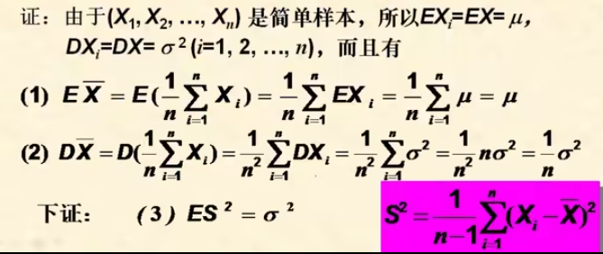

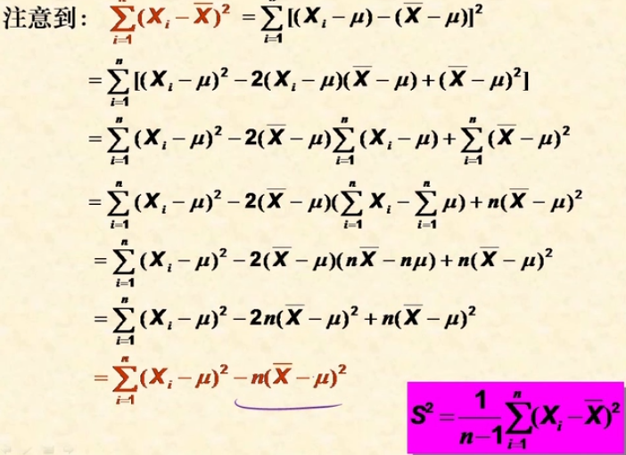

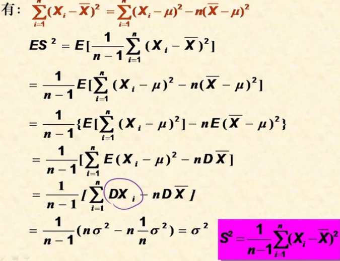

---

### 抽样分布

#### 卡方分布

$\Chi^2$分布，写作$\Chi^2(n)$

定理6.2:

$$
x_i都独立，N(0,1),\Chi^2=\sum^n_{n=1}x_i^2\sim \Chi^2(n)\\
EX=n,DX=2n\\
由中心极限定理\\
X\sim \Chi^2(n),n无穷大,\frac{X-n}{\sqrt{2n}}\sim N(0,1)\\
$$

定理6.3:

$$
X\sim \Chi^2(n),Y\sim \Chi^2(m)\\
X,Y独立,X+Y\sim \Chi^2(m+n)
$$

推论:

$$
X_i\sim \Chi^2(m_i)独立,\sum x_i\sim \Chi^2(\sum m_i)\\
上\alpha分位权:P(\Chi^2>\underbrace{\Chi^2_\alpha(n)}_{点})=\underbrace{\alpha}_{面积即概率}
$$

在分布里对X乘除是乘除标准差，如下

$$
X_i\sim N(0,2^2)\\
\frac{X_i}{2}\sim N(0,1)
$$

#### t分布

$X\sim t(n)$

定理6.4:

$$
X\sim N(0,1),Y\sim \Chi^2(n)\\
X,Y独立则是t分布即\frac{X}{\sqrt{Y/n}}\sim t(n)
$$

标准正态和卡方构成t分布

$$
P(T>t_\alpha(n))=\alpha\\
t_{1-\alpha}(n)=-t_\alpha(n)
$$

t分布得出的是点，所以这里是点对称因此坐标有负

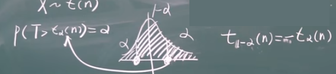

#### F分布

$$
F(n_1,n_2)
$$

定理6.5:

$$
X\sim\Chi^2(n_1),Y\sim\Chi^2(n_2)，X,Y独立\\
\frac{X/n_1}{Y/n_2}\sim F(n_1,n_2)\\
\frac{Y/n_2}{X/n_1}\sim F(n_2,n_1)\\
所以\frac{1}{F}\sim F(n_2,n_1)
$$

**注意**:会出现两个n不同的情况，除的时候要注意

$F_{1-\alpha}(n_1,n_2)=\frac{1}{F_\alpha(n_2,n_1)}$

证明:

$$
F\sim F(n_1,n_2),\frac{1}{F}\sim F(n_2,n_1)\\
\begin{aligned}
1-\alpha&=P(F>F_{1-\alpha}(n_1,n_2))\\
&=P(\frac{1}{F}<\frac{1}{F_{1-\alpha}(n_1,n_2)})\\
&=1-P(\frac{1}{F}\ge \frac{1}{F_{1-\alpha}(n_1,n_2)})
\end{aligned}\\
=>P(\frac{1}{F}>\frac{1}{F_{1-\alpha}(n_1,n_2)})=\alpha\\
F_\alpha(n_2,n_1)=\frac{1}{F_{1-\alpha}(n_1,n_2)}\\
这里左侧是用了开头的条件
$$

**注意**:这里取值倒数时大于等于变小于等于，大于变小于

补充:F分布的概率密度函数很复杂

---

### 正态总体下的抽样分布

总体是正态分布，抽样本构造统计量的分布

#### 定理6.6

$$
X\sim N(\mu,\sigma^2),\{X_1,\cdots,X_n\}样本
$$

(1)$\overline{X}\sim N(\mu,\frac{\sigma^2}{n}),\frac{\overline{X}-\mu}{\frac{\sigma}{\sqrt{n}}}=\frac{\overline{X}-\mu}{\sigma}\sqrt{n}\sim N(0,1)$

证明:

$$
E\overline{X}=E(\frac{1}{n}\sum X_i)=\frac{1}{n}\sum EX_i=\frac{1}{n}n\mu=\mu\\
D\overline{X}=D(\frac{1}{n}\sum X_i)=\frac{1}{n^2}\sum DX_i=\frac{1}{n^2}n\sigma^2=\frac{\sigma^2}{n}\\
\overline{X}=\frac{1}{n}\sum X_i,还是正态\\
方差除以n离散程度小了
$$

(2)$\frac{n-1S^2}{\sigma^2}=\frac{1}{\sigma^2}\sum (X_i-\underbrace{\overline{X}}_{样本均值})^2\sim \Chi^2(n-1)$

n-1是自由度，这里为什么会-1是因为平均值有方程，这方程就好比一个约束使得自由度-1(可以参考矩阵的秩)

或者用方程理解，从得到一组解$[1,2]^T,[2,1]^T$变成了一个解$[1,1]^T$

(3)$\overline{x}与S^2独立$

#### 定理6.7

(1)$\frac{1}{\sigma^2}\sum(X_i-\mu)^2\sim \Chi^2(n),\sum(\frac{X_i-\overline{\mu}_{总体期望}}{\sigma})^2\sim \Chi^2(n)$

(2)$\frac{\overline{X}-\mu}{S}\sqrt{n}\sim t(n-1)$

得法:

$$
用标准正态分布(6.6(1))变卡方分布\\
\frac{\frac{\overline{X}-\mu}{\sigma}\sqrt{n}}{\sqrt{\frac{(n-1)S^2}{\sigma^2}/(n-1)}}\sim t(n-1)\\
约分后得到
$$

#### 两个正态总体

$$
X\sim N(\mu_1,\sigma_1^2),Y\sim N(\mu_2,\sigma^2_2),\{X_1\cdots,X_{n_1}\},\{Y_1,\cdots,Y_{n_2}\}
$$

(1)$\frac{(\overline{X}-\overline{Y})-(\mu_1-\mu_2)}{\sqrt{\frac{\sigma^2_1}{n_1}+\frac{\sigma^2_2}{n_2}}}\sim N(0,1)$

证明:

$$
\overline{X}\sim N(\mu,\frac{\sigma^2_1}{n_1}),\overline{Y}\sim N(\mu_2,\sigma^2_2/n_2)\\
\overline{X}-\overline{Y}\sim N(\mu_1-\mu_2,\frac{\sigma_1^2}{n_1}+\frac{\sigma^2_2}{n_2})\\
正态分布线性组合还是正态分布，然后标准化自然是标准正态分布
$$

(2)$\frac{S^2_1/\sigma^2_1}{S^2_2/\sigma^2_2}\sim F(n_1-1,n_2-1)$

证明:

$$
\frac{(n_1-1)S_1^2}{\sigma_1^2}\sim \Chi^2(n_1-1),\frac{(n_2-1)S^2_2}{\sigma^2_2}\sim \Chi^2(n_2-1)\\
两者按照F分布公式X/n，然后划去n-1就是上述式子
$$

(3)$\sigma^2_1=\sigma^2_2=\sigma时,T=\frac{(\overline{X}-\overline{Y})-(\mu_1-\mu_2)}{\sqrt{\frac{(n_1-1)S_1^2+(n_2-1)S_2^2}{n_1+n_2-2}}\sqrt{\frac{1}{n_1}+\frac{1}{n_2}}}\sim t(n_1+n_2-1)$

例子:

$$
X\sim N(\mu,\sigma^2),(X_1,\cdots,X_{n+1})样本,\overline{X_n},S^2_n是(X_1,\cdots,X_n)的均值和方差\\
求\frac{X_{n+1}-\overline{X}}{S_n}\sqrt{\frac{n}{n+1}}的分布\\
\overline{X}\sim N(\mu,\frac{\sigma^2}{n}),X_{n+1}\sim N(\mu,\sigma^2)\\
X_{n+1}-\overline{X}\sim N(0,(1+\frac{1}{n})\sigma^2)\\
用了D(X\pm Y)=DX+DY,E(X-Y)=EX-EY\\
U=\frac{X_{n+1}-\overline{X}}{\sigma\sqrt{\frac{n+1}{n}}}\sim N(0,1)\\
遇到S_n和\sigma的关系用卡方分布\\
\frac{(n-1)S_n^2}{\sigma^2}\sim \Chi^2(n-1)\\
联想到\frac{X}{\sqrt{Y/n}}\\
\frac{U}{\sqrt{\frac{(n-1)S_n^2}{\sigma^2}/n-1}}\sim t(n-1)\\
由标准和卡方构成t分布，左侧约分就是题目要求
$$

---

### 参数估计

#### 点估计和区间估计

点估计:样本点的估计值

区间估计:样本区间的估计

#### 矩估计法

用样本的矩替换总体的矩

总体的矩<——样本的矩

一阶$EX$<——一阶$\overline{X}=\frac{1}{n}\sum X_i$

二阶$EX^2$<——二阶$A_2=\frac{1}{n}\sum X_i^2$

例子:

$$
X\sim N(\mu,\sigma^2),(X_1,\cdots,X_n)样本\\
求\mu,\sigma^2矩估计\\
总体一阶:EX=\mu,样本一阶:\overline{X}=\frac{1}{n}\sum X_i\\
\hat{u}=\overline{X}\\
样本二阶:A_2=\frac{1}{n}X_i^2\\
总体二阶:EX^2=DX+(EX)^2=\sigma^2+\mu^2\\
\hat{\sigma^2}=A_2-\hat{\mu^2}=\frac{1}{n}\sum X_i^2-\overline{X^2}=\frac{1}{n}\sum (X_i-\overline{X})^2\\
=\frac{1}{n}\sum X_i^2-2\frac{1}{n}\overline{X}\sum X_i+\frac{1}{n}n\overline{X^2}\\
因为\frac{1}{n}\sum X_i=\overline{X}\\
=\frac{1}{n}\sum X_i^2-2\overline{X^2}+\overline{X^2}\\
=\frac{1}{n}\sum X_i^2(恰好是二阶中心距)
$$

#### 极大似然估计法

P大的事件比P小的事件更容易发生，将使A发生的最大的参数值作为它的估计值

解题步骤:

(1)写出总体(离散用)概率/(连续用)密度函数

(2)写似然函数$L(\lambda)$

(3)两边取$\ln$

(4)两边对$\lambda$导，令之为0

离散例子:

$$
总体X\sim P(\lambda),(X_1,\cdots,X_n)样本,求\lambda 的极大似然估计\\
总体概率函数为P(X=k)=\frac{\lambda^k}{k!}e^{-\lambda},(k=0,1,\cdots)\\
则\lambda的似然函数:L(\lambda)=\prod^n_{i=1}\frac{\lambda^{X_i}}{X_i!}e^{-\lambda}\\
因为似然函数就是取到这些样本的概率，因此要连乘\\
因为X_i是观测到的所以是已知的，唯一未知的是\lambda\\
L(\lambda)=\frac{\lambda^{X_1+\cdots+X_n}}{\prod X_i!}e^{-n\lambda}\\
\ln L(\lambda)=-\ln \prod X_i!+(X_1+\cdots+X_n)\ln \lambda-n\lambda \underbrace{\ln e}_1\\
连乘一般用\ln 来化为加减\\
\frac{\mathrm{d}\ln L(\lambda)}{\mathrm{d}\lambda}=\frac{X_1+\cdots+X_n}{\lambda}-n=0\\
\lambda=\frac{X_1+\cdots+X_n}{n}=\overline{X}
$$

连续例子:

$$
f(x,\lambda)=\begin{cases}
\lambda e^{-\lambda x},x>0\\
0,x\le 0
\end{cases}\\
L(\lambda)=\prod \lambda e^{-\lambda x_i}(要注意，这里概率为0的事情不在样本内)\\
\ln L(\lambda)=n\ln \lambda-\lambda(x_1+\cdots+x_n)\\
\frac{\mathrm{d}\ln L(\lambda)}{\mathrm{d}n}=\frac{n}{\lambda}-(x_1+\cdots+x_n)=0\\
\lambda=\frac{n}{x_1+\cdots+x_n}=\frac{1}{\overline{X}}
$$

**拓展**:

L内可能是多元的，最后一步要替换为求偏导并令之为0

若无法解出，比如可能会出现下面情况(均匀分布)

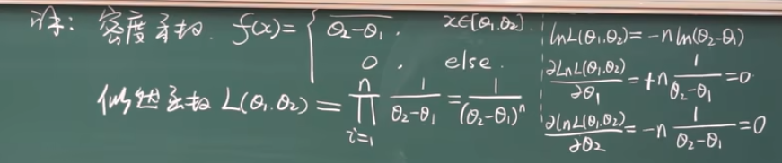

这时候就要使得似然函数最大，这里就让分母两个变量最接近

在均匀里面就是让左边的最右，右边的最左

$\hat{\theta_1}=min\{x_1,\cdots,x_n\},\hat{\theta_2}=max\{x_1,\cdots,x_n\}$

#### 点估计的优良性准则

#### 无偏性

无偏性:$E\hat{\theta}=\theta$

(1)任何分布中，总体$X,EX=\mu,DX=\sigma^2,(x_1,\cdots,x_n)$

- (1)$\overline{X}$是$\mu$的无偏估计，$E\overline{X}=\mu$
- (2)样本方差$S^2$是$\sigma^2$的无偏估计,$ES^2=\sigma^2$
- (3)未修正方差$S_o^2$是$\sigma^2$的有偏估计
  
(2)a是b无偏，g(a)不一定是g(b)是无偏。$S^2$是$\sigma^2$无偏，$\sqrt{S^2}$不是$\sqrt{\sigma^2}$无偏

求期望多

#### 有效性

有效性:$D(\hat{\theta_1})\le D(\hat{\theta_2})$

$$
DX=\sigma^2,(a_1+\cdots)^2=1\\
D\hat{\theta}=a_1^2DX_1+\cdots=\sigma^2(a_1^2+\cdots)\ge \frac{\sigma^2}{n}\\
1=(a_1+\cdots)^2\le n(a_1^2+\cdots)\\
基本不等式:(a_1+\cdots)/n \le \sqrt{a_1^2+\cdots}.n
$$

求方差多

#### 相合性(一致性)

$$
\lim_{n\rightarrow  +\infin}P(|\hat{\theta}-\theta|<\epsilon)=1
$$

几乎不考

---

## 置信区间

### 置信度和枢轴变量

置信度:$[\hat{\theta_1},\hat{\theta_2}]$能套住$\theta$的概率

枢轴变量:$I=I(\underbrace{T}_{已知的},\underbrace{\theta}_{未知的})$，I分布已知且与$\theta$无关，这个就是**枢轴变量**

例子:$P(V_{1-\frac{\alpha}{2}}\le I(T,\theta)\le V_{\frac{\alpha}{2}})=1-\alpha$，V是在这块位置的分权

左右对称分权后区间长度的反而比不均的要小

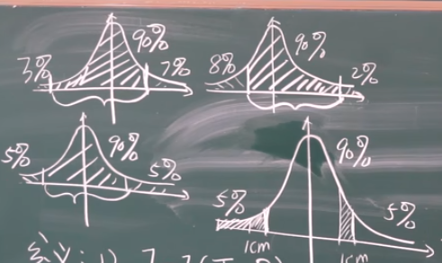

---

### 正态总体均值和方差区间估计

$$
\sigma^2已知,估计\mu\leftarrow 未知参数\\
U=\frac{\sqrt{n}(\overline{x}-\mu)}{\sigma}\sim N(0,1)
$$

例子:

给定$1-\alpha$,令$P(U)>u_{\frac{\alpha}{2}}=\frac{\alpha}{2},\Phi_o(u_{\frac{\alpha}{2}})=1-\frac{\alpha}{2}$

$$
P(-u_{\frac{\alpha}{2}}\le \frac{\sqrt{n}(\overline{X}-\mu)}{\sigma}\le u_{\frac{\alpha}{2}})=1-\alpha\\
-\sigma u_{\frac{\alpha}{2}}\le \sqrt{n}(\overline{X}-\mu)\le \frac{u_{\frac{\alpha}{2}}}{\sigma}\\
\overline{X}-\frac{\sigma u_{\frac{\alpha}{2}}}{\sqrt{n}}\le \mu\le \frac{\sigma u_{\frac{\alpha}{2}}}{\sqrt{n}}+\overline{X}
$$

---

### 估计表

$$
\begin{aligned}
\mu &|& \sigma^2已知 &|& \frac{\overline{X}-\mu}{\sigma}\sqrt{n}\sim N(0,1) &|& [\overline{X}-\frac{\sigma}{\sqrt{n}u_{\frac{\alpha}{2}}},\overline{X}+\frac{\sigma}{\sqrt{n}u_{\frac{\alpha}{2}}}]\\
\mu &|& \sigma^2未知 &|& \frac{\overline{X}-\mu}{S}\sqrt{n}\sim t(n-1) &|& [\overline{X}-\frac{S}{\sqrt{n}t_{\frac{\alpha}{2}}(n-1)},\overline{X}+\frac{S}{\sqrt{n}t_{\frac{\alpha}{2}}(n-1)}]\\
\sigma^2 &|& \mu 未知 &|& \frac{1}{\sigma^2}\sum^n_{i=1}(X_i-\mu)^2\sim \Chi^2(n) &|& [\frac{\sum(X_i-\mu)^2}{\Chi^2_{\frac{\alpha}{2}}(n)},\frac{\sum(X_i-\mu)^2}{\Chi^2_{\frac{1-\alpha}{2}}(n)}]\\
\sigma^2 &|& \mu 未知 &|& \frac{(n-1)S^2}{\sigma^2}\sim \Chi^2(n-1) &|& [\frac{(n-1)S^2}{\Chi^2_{\frac{\alpha}{2}}(n-1)},\frac{(n-1)S^2}{\Chi^2_{\frac{1-\alpha}{2}}(n-1)}]
\end{aligned}
$$

---

> 以下为姜老师所讲内容，考虑到弹幕所言可能不考仅进行粗略记录，待后续补全

## 假设检验

### 基本概念

1.假设$\begin{cases}
参数假设\\
非参数假设
\end{cases}$

2.假设检验$\begin{cases}
参数假设检验\\
非参数假设检验
\end{cases}$

3.假设检验问题$\begin{cases}
显著性假设检验问题-唯一假设H_0\\
H_0对H_1假设
\end{cases}$

---

### 假设的步骤

1.提出$H_0$:对$H_1\cdots$

2.假定$H_0$成立，取统计量$T\sim$已知分布

3.给$\alpha,P\{(X_1,\cdots)\in W\}=\alpha$

4.由样本求出T的值，如果落在里面，拒绝$H_0$接受$H_1$反之亦然

---

### 正态总体的参数假设检验

#### U检验法

(1)$H_0:\mu=\mu_o,H_1:\mu\ne \mu_o$

(2)假定$H_0$成立，$X\sim N(\mu_o,\sigma^2_o)=>$取统计量$U=\frac{\overline{X}-\mu_o}{\sigma_o/\sqrt{n}}\sim N(0,1)$

(3)给定$\alpha$，由$P\{|U|>u_{\frac{\alpha}{2}}\}=\alpha=>u_{\frac{\alpha}{2}}$，拒绝域$W=\{(X_1,\cdots)|\ |u|>u_{\frac{\alpha}{2}}\},\overline{W}=\cdots$

#### sigma的假设检验

$\Chi^2$检验

TL;DT(to long;don't type)

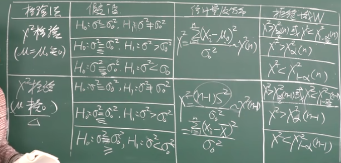

#### 两个正态总体的假设检验

(1)提出$H_0:\mu_1=\mu_2,H_1:\mu_1\ne \mu_2$

(2)假定$H_0$成立，取$U=\frac{\overline{X}-\overline{Y}}{\sqrt{\frac{\sigma^2_1}{n_1}}+\frac{\sigma^2_2}{n_2}}\sim N(0,1)$

(3)给定$\alpha$，由$P\{|U|<u_{\frac{\alpha}{2}}\}=\alpha,u_{\frac{\alpha}{2}}=>$W=$\begin{cases}
(x_1,\cdots)|\\
(y_1,\cdots)|\ |u|>u_{\frac{\alpha}{2}}
\end{cases}$

#### 两个总体方差的差异性检验(F检验法)

(1)提出$H_0:\sigma^2_1=\sigma^2_2,H_1:\sigma^2_1\ne \sigma_2^2$

(2):假设$H_0$成立，取$F=\frac{S_1^2}{S_2^2}\sim F(n_1-1,n_2-1)$

(3)给定$\alpha$，由$P\{F>F_{\frac{\alpha}{2}}\}=P\{F>F_{\frac{1-\alpha}{2}}\}=\frac{\alpha}{2}$

$$
W=\begin{cases}
(x_1,\cdots,x_{n_1})|\\
(y_1,\cdots,x_{n_2})|f>f_{\frac{\alpha}{2}}(n_1-1,n_2-1)
\end{cases}
$$

(4)计算F的值f，比较后下结论
