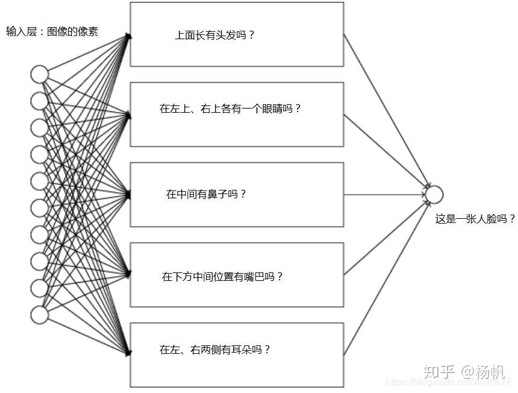

# 机器学习

符号备忘:$\vee\wedge\neg\equiv\prec\succ\vdash\dashv\oplus\ominus$

## 选择目标函数的表示

以棋局举例

$$
\begin{cases}
b最终胜局，&V(b)=100\\
b最终负局，&V(b)=-100\\
b最终和局，&V(b)=0\\
b不是最终棋局，&V(b)=V(b')
\end{cases}\\
b'是b开始双方都采用最优对策到达的终局\\
用V表示理想目标函数，用\hat{V}表示实际学习到的函数\\
x_1:棋盘黑子数\\
x_2:棋盘红子数\\
x_3:棋盘黑王数\\
x_4:棋盘红王数\\
x_5:被红子威胁的黑子数(下次被吃的黑子数)\\
x_6:被黑子威胁的红子数\\
\hat{V}(b)=w_0+w_1x_1+\cdots+w_6x_6\\
训练值:V_{train}(b),训练样例:<b,V_{train}(b)>\\
训练样例:<<x_1=3,x_2=0,x_3=1,x_4=0,x_5=0,x_6=0>,+100>
$$

### 1.估计训练值

把任何中间棋局b的训练值$V_{train}(b)$赋以$\hat{V}(Successor(b))$，括号内为b之后再轮到程序走棋的状态也就是程序走一步和对手回应一步后的棋局

可以归纳为$V_{train}(b)\leftarrow \hat{V}(Successor(b))$

### 2.**调整权值**

定义**最佳拟合**(best fit)，让训练值和假设值的误差平方和E最小

$E\equiv \underset{<b,V_{train}(b)>\in training\ examples}{\sum}(V_{train}(b)-\hat{V}(b))^2$

### 3.LMS最小均方法

对于每个训练样例

- 使用当前权计算$\hat{V}(b)$
- 对每个权进行如下更新
  - $w_i\leftarrow w_i+\eta (V_{train}(b)-\hat{V}(b))x_i$

收敛，因为当x为0时不会改变

由上述过程，我们将整体分为四个模块，执行系统(解决问题)、鉴定器(给出训练法则)、泛化器(LMS)、实验生成器(假设输入给出输出)

流程是从左到右依次连接，尾部和首部相连的循环

## 概念学习

给定一定数据集，其中符合要求的叫正例，不符合叫反例

例子写作<?,Cold,$\empty$>

- ?代表任意可接受值
- 明确属性值
- $\empty$代表不接受任何值

最一般的假设就是每个都是正例也就是<?,?,?>

最特殊的假设是每天都是反例，表示为<$\empty,\empty,\empty$>

例子:什么日子适合运动

- Sky:Sunny,Cloudy,Rainy
- AirTemp:Warm,Cold
- Humidity:Normal,High
- Wind:Strong,Weak
- Water:Warm,Cold
- Forest:Same,Change

因此，这个空间内可以存在3X2X2X2X2X2=96种**不同**的实例

假设空间H是每个假设h为X上定义的布尔函数$h:X\rightarrow \{0,1\}$

这个空间的H有5X4X4X4X4X4=5120种语法不同的假设(里面的选项有?和$\empty$)

注意到包含$\empty$的假设代表空实例集合，即它们将每个实例都分类为反例，这个集合算作1个

所以实际语义不同的假设只有1+4X3X3X3X3X3=973个

假设空间中的关系是一种偏序关系，也就是单向向某个方向发展，比如越来越一般

### FIND-S:寻找极大特殊假设

FIND-S一般用**特殊序**

- h初始化为H重最特殊假设$<\empty,\empty\cdots>$
- 对每个正例x
  - 对h的每个属性约束$a_i$
  - 如果x满足$a_i$
  - 不做任何处理
  - 否则将h中$a_i$替换为x满足的下一个更一般约束
- 输出假设h

以下为例子

$$
h\leftarrow <\empty,\empty,\empty,\empty,\empty,\empty>\\
遇到正例，因为每个\empty都不被满足所以全部替换\\
h\leftarrow <Sunny,Warm,Normal,Strong,Warm,Same>\\
而后还是正例，有不同，继续一般化\\
h\leftarrow <Sunny,Warm,Normal,?,Warm,Same>\\
以此类推得到最一般化结果
$$

### 候选消除算法

候选消除算法一般用**特殊序**

定义:一个假设h与训练样例集合D**一致**，当且仅当对D中每一个样例<x,c(x)>都有h(x)=c(x)

$Consistent(h,D)\equiv (\forall <x,c(x)>\in D)\ h(x)=c(x)$

定义:关于假设空间H和训练样例集D的**变型空间**，标记为$VS_{H,D}$，是H中训练样例D一致的所有假设构成的子集

$VS_{H,D}\equiv \{h\in H|Consistent(h,D)\}$

假设空间H是训练样例D的**变型空间**，它包含目标概念的所有合理的变型

### 列表后消除法

- 变型空间$VersionSpace\leftarrow$包含$H$中所有假设的列表
- 对每个训练样例<x,c(x)>从变型空间中移除所有h(x)$\ne$c(x)的假设h
- 输出$VersionSpace$中的假设列表

**最一般到最特殊间偏序结构**来生成S和G集合之间的所有假设是变型空间的简洁表达

最一般和最特殊也叫**极大一般和极大特殊**

**一般边界G**:H中与D相一致的极大一般成员的集合

$G\equiv \{g\in H|Consistent(g,D)\wedge[\neg \exist g'\in H]((g'>_g g)\wedge Consistent(h',D))\}$

**特殊边界S**:H中与D相一致的极大特殊成员的集合

$G\equiv \{s\in H|Consistent(s,D)\wedge[\neg \exist s'\in H]((s>_g s')\wedge Consistent(s',D))\}$

### 候选消除学习算法

- G初始化为极大一般假设
- S初始化为极大特殊假设
- 对每个训练样例d进行以下操作:
  - 如果d是正例
    - 从G中移去与d不一致的假设
    - 对S中每个与d不一致的假设s
      - 从S中移去s
      - 把s的所有极小一般化式h加入S，其中h满足与d一致且G的某个成员比h更一般(至少不要全特殊)
      - 从S中移去这样的假设:它比S中另一假设更一般
  - 如果d是反例
    - 从S中移去与d不一致的假设
    - 对G中每个与d不一致的假设g
      - 从G中移去g
      - 把g的所有极小一般化式h加入G，其中h满足与d一致且S的某个成员比h更特殊(至少不要全一般)
      - 从G中移去这样的假设:它比G中另一假设更特殊

例子:

步骤1:

$$
S_0:<\empty,\empty,\empty,\empty>\\
S_1:<Sunny,Warm,Normal,Strong>样例1\\
S_2:<Sunny,Warm,?,Strong>样例1+2\\
G_0,G_1,G_2:<?,?,?,?>\\
样例1:<Sunny,Warm,Normal,Strong>,Yes\\
样例2:<Sunny,Warm,Strong,Strong>,Yes
$$

步骤2:

$$
S_2,S_3:<Sunny,Warm,?,Strong>\\
G_2:<?,?,?,?>\\
G_3:<Sunny,?,?,?>,<?,Warm,?,?>\\
样例3:<Rainy,Cold,High,Strong>,No
$$

以此类推，如果是正例的，进行比对，如果相同先加入，不同先取?

如果是反例，进行比对，相同先取?，不同先提出

一般而言，最优情况是$\log_2|VS|$，每次对错各一半，二分，然而绝大多数情况都是大于这个值的

### 无偏学习和归纳偏置

学习器如果不做预先假定，实际上是无法对未见过的实例进行分类的，不过候选消除能够让其泛化也是因为它是**有偏的**，有偏采用的是合取方式

对于无偏学习，它们采用的是析取式表达，比如Sky=Sunny,Sky=Rainy=>$<Sunny,?>\vee <Rainy,?>$

样例表示(1~3正例，4~5反例):

$$
S:\{x_1\vee x_2\vee x_3\}\\
G:\{\neg (x_4\vee x_5)\}
$$

归纳学习能对**未见数据**进行分类

对于归纳学习需要的预先假定称作**归纳偏置**，借此，学习能器从训练样例中泛化并推断新实例的分类过程中采取的策略

表达:$L(x_i,D_c)$指学习算法L以及任意目标概念c提供任意数据$D_c=\{x,c(x)\}$并让L对其分类

归纳推理过程:$(D_c\wedge x_i)\succ L(x_i,D_c)$

符号意思是后者被前者归纳推理得到

以上面的例子可以说$L(x_i,D_c)\succ (运动=yes)$

然而归纳学习无法得知推论的正确性，也就是并不是演绎派生，因此要在其上加个前提集合B使得所有实例$x_i$满足:

$(B\wedge D_c\wedge x_i)\vdash L(x_i,D_c)$

符号意思是后者由前者演绎派生(或者是证明)出

总结定义:实例集合X中c是其中任一概念，L的**归纳偏置**是最小断言集合B，它使得任意目标概念c和响应的训练样例$D_c$满足:

$(\forall x_i\in X)(B\wedge D_c\wedge x_i)\vdash L(x_i,D_c)$

## 决策树学习

决策树学习是**逼近离散值目标函数**的方法

而且最终得到的决策树可以划分为多个if-then规则以提高可读性

比如有
$$
Sky\begin{cases}
Sunny->Humidity\begin{cases}
High=No\\
Normal=Yes
\end{cases}\\
Rain->Wind\begin{cases}
Strong=No\\
Weak=Yes
\end{cases}
\end{cases}
$$

通常决策树代表**实例属性值约束的合取的析取式**，从树根到树叶的每一条路径对应一组属性值约束的**合取**

比如说上面就可以表达为

$$
(Sky=Sunny\wedge Humidity=Normal)\\
\vee (Sky=Rain\wedge Wind=Weak)
$$

### 适用条件

- 实例是属性-值对而且是一系列固定的属性
- 目标函数具有离散的输出值比如yes或no
- 可能需要析取的描述
- 训练数据**可包含错误**，保障了它的健壮性
- 训练数据可包含**缺失属性值**的实例

### ID3算法

这个算法是后继的C4.5算法的基础

自顶向下生成决策树，然后用贪婪搜索，不回溯重新考虑(遇到爬山不行)

粗略分析:(1)优先选择短的树(2)选择信息增益高的属性离根近的树

- 创建Root
- 实例正，返回label=+的单结点树Root
- 实例反，返回label=-的单结点树Root
- Attribute为空，返回单结点Root,label=最普遍的Target_attribute值
- 否则开始
  - A$\leftarrow$Attributes中实例能力最好的属性
  - Root的决策属性$\leftarrow$A
  - 对于A的每个可能值$v_i$
    - 在Root下加新分支测试A=$v_i$
    - 令$Example_{v_i}$为实例中满足A属性值为$v_i$的子集
    - 如果$Example_{v_i}$为空
      - 在这个新分支下加一个叶，label=最普遍的Target_attribute值
      - 否则加子树ID3($Example_{v_i}$,Target_attribute,Attributes-\{A\})(也就是一个递归过程)
- 结束
- 返回Root

衡量的标准称作"信息增益"

#### 1.用熵度量样例的均一性

熵刻画了任意样例集的纯度，我们定义包含关于某个目标概念的正反样例集S，其布尔型分布熵为:

$Entropy(S)\equiv -p_\oplus \log_2 p_\oplus - p_\ominus \log_2 p_\ominus$

$p_\oplus$是正例的比例，另外一个是反例的比例，我们定义$0\log 0=0$

假如说14个样例，9正4反，写作[9+,4-]，其熵为:

$Entropy([9+,4-])=-(9/14)-(9/14)\log_2 (9/14) - (5/14) \log_2 (5/14)=0.940$

假如目标属性有c个不同的值，那么S相对于c个状态的分类的熵定义为:

$Entropy(S)\equiv \sum^c_{i=1}-p_i\log_2 p_i$

其中$p_i$是S中属于类别$i$的分类，log的底数还是2，因为熵是以二进制位的个数来编码长度的

熵定义了集合S中任意成员分类所需的最小二进制位数(有小数要向上取整)

比如0.8需要赋予正例集合较短的编码，可能性较小的反例集合较长的编码，平均每条消息的编码少于1个二进制位

不过这里要注意如果有c个可能值，熵最大可能是$\log_2c$

#### 2.用信息增益度量期望的熵降低

属性的信息增益因为使用某个属性分割样例而导致期望熵降低

对属性A相对样例集合S的**信息增益**定义为:

$Gain(S,A)\equiv Entropy(S)-\underset{v\in Values(A)}{\sum}\frac{|S_v|}{|S|}Entropy(S_v)$

Values(A)是属性A所有可能值的集合，$S_v$是S中属性A的值为v的子集

上述式子第一项是S的熵，后面是用A分类S后熵的期望值(每个子集的熵的加权和，权值是$S_v$占S的比例)，信息增益会因为期望占比增加而减少

可以理解为大家都差不多，因此信息都差不多

也就是说Gain(S,A)是由于给定属性A的值而得到的**关于目标函数值**的信息

例子:

9+,5-,正例6个反例2个Wind=Weak,剩下是Wind=Strong

我们要得到按Wind分类的信息增益

$$
Values(Wind)=Weak,Strong\\
S=[9+,5-]\\
S_{Weak}\leftarrow [6+,2-]\\
S_{Strong}\leftarrow [3+,3-]\\
\begin{aligned}
Gain(S,Wind)&=Entropy(S)-\underset{v\in \{Weak,Strong\}}{\sum}\frac{|S_v|}{|S|}Entropy(S_v)\\
&=0.940-(8/14)Entropy(S_{Weak})-(6/14)Entropy(S_{Strong})\\
&=0.048
\end{aligned}
$$

通常选择信息增益**最高**的一个，因为这代表这是最明显的属性

同时，这是个递归操作(自顶向下)

最初的根就是总的样例集S，然后对每个候选属性比如Sky、Humidity、Wind进行判断

假如说Sky是最高，那么用Sky的属性(叶)和那些根进行比对，最高信息增益的就是这个属性(叶)连接的根

比如Sunny-Humidity是因为Gain(Sunny,Humidity)最高

会不断重复直到满足一下任一条件

(1)所有属性被这条路径包括

(2)与这个结点关联的所有训练样例都具有相同的目标属性值(熵=0)

#### ID3的优缺点

优:因为每个有限离散值函数可被表示为某个决策树，避免了搜索不完整假设空间。降低了对错误样例的敏感度，通过修改其终止法则可以接受不完全拟合训练假设，容易扩展到含有噪声的训练数据

缺:不能判断其它决策树是否与已有训练数据一致，仅维护单一的当前假设

优缺共有:不进行回溯，快速得到局部最优解但如同常见爬山可见的问题，它并不一定是全局最优

### 决策树学习的归纳偏置和短假设优先

ID3搜索范围是**完整的**假设空间，但是**不彻底**搜索这个空间，它的归纳偏置是搜索策略的结果，假设空间里没有引用额外的偏置

而变形空间候选消除法是**不完整**假设空间，但**彻底**搜索这个空间，它的归纳偏置完全是假设表示的表达能力的结果，搜索策略没有引用额外的偏置

简单讲:ID3是因为它的**搜索策略**，候选消除是因为**搜索空间的定义**

前者可列举的假设没有硬性限制，这种偏置称作**优选偏置**，后者假设有限定所以是**限定偏置**，通常前者更好

为什么短的假设优先?

奥卡姆剃刀:优先选择拟合数据的最简单的假设

### 避免过拟合

假如说某个假设对训练样例的拟合度更差但是表现更好，那么后者就是**过拟合**训练数据

避免方法

- 训练和验证集方法，及早停止树增长，在ID3完美分类前停止
- 后修剪法，允许过拟合，然后进行修剪(常规而言更成功，因为难预估何时过拟合)，下为方法
  - 使用与训练样例不同的分离样例，然后评估修剪方法的效用
  - 使用所有可用数据进行训练，但进行统计测试来估计扩展(或修剪)一个特定结点是否有可能改善在训练集合外的实例上的性能
  - 使用一个明确的标准衡量训练样例和决策树的复杂度每当编码长度最小时停止增长，这种方法基于一种启发式规则叫做最小描述长度

一般分离样例作为验证集合占样例三分之一

1.错误率降低修剪

修剪步骤:删除以此结点为根的子树，使它成为叶子结点，把和该结点关联的训练样例最常见分类赋给它。仅当修剪后的树对于验证集合的性能不比原来的树差时才删除该结点

修剪的一般是巧合发生的点，反复修剪可以使精度上升的结点直到进一步修剪有害

2.规则后修剪

步骤:

(1)导出决策树，增长决策树直到更好地拟合，允许过拟合

(2)将决策树转化为等价的规则集合，方法是从根结点到叶子结点的每一条路径创建一条规则

(3)通过删除任何可能导致估计精度提高的前件来修剪(泛化)每一条规则

(4)按照修剪后的规则的精度进行排序，并且按照这样的顺序应用规则来分类后面的实例

转为规则集的好处

- 可以区分决策结点使用的不同上下文。因为贯穿结点的每条路径产生一条不同规则，每个路径的修剪决策可以不同，相反，直接修剪本身要么完全删除结点要么保留原本状态
- 消除了根结点附近的属性测试和叶结点附近的属性测试的区别。避开了零乱的记录问题，比如，修剪根结点但保留部分子树如何重新组织这棵树
- 提高可读性

### 合并连续值属性

可以通过动态定义新的离散值属性实现，即先把连续值属性的至于**分割为离散的区间集合**

**候选阈值**:比如48No60Yes那么这中间存在可能，因此计算变化时取中值，比如这里就可以计算$Temperature_{>54}$的信息增益，以此类推并选择最好的

这时候的连续值就可以和离散值一起参与决策树

### 属性选择和其他度量标准

信息增益度量具有内在偏置，偏向具有**较多值**的属性，比如说Date的信息增量，日期可以有非常多值，因此它的信息增量会很大，它可以理想地分类训练数据，但是对于后来数据的性能会想当差，不是一个好的预测器

有太多可能值必然要将其分割为非常多小空间，避免这个不足可以选择**增率比例**度量标准

#### 增率比例

新增一个称作**分裂信息**的项来惩罚类似Date的属性，会用于衡量分裂数据的广度和均分性

$SplitInformation(S,A)\equiv -\overset{c}{\underset{i=1}{\sum}}\frac{|S_i|}{|S|}\log_2 \frac{|S_i|}{|S|}$

从1到c的S是c个值的属性A分割S而形成的c个样例子集，分裂信息本质就是S关于属性A的各值的熵

增率比例定义如下:

$GainRatio(S,A)=\frac{Gain(S,A)}{SplitInformation(S,A)}$

分裂信息项会阻碍选择值为**均匀分布**的属性，比如含有n个样例的集合被属性A彻底分割(一个样例一组)，分裂信息值为$\log_2n$。反之，布尔属性如果恰好平分两半，分裂信息是1，如果两个属性是统一的信息增益，显然后者得分更高

假如$|S_i|\approx |S|$，分母可能是0或非常小，这时可能会使得增率比例非常大，因此要采用启发式规则，先计算每个属性的增益，后对增益高过平均值的属性应用增率比例测试

还有距离度量、属性选择度量等，需要根据场景选择

#### 缺少属性值

1.给该节点添加含它这批训练样例集中最常见值(未分类样例集)

2.将其赋予被分类为c(x)的训练样例中该属性的最常见值(已分类样例集)

第二种策略是为A每个可能赋予一个概率而不是简单赋予常见值，根据结点样例上A的不同值的出现概率，可以再次估计

比如，给定布尔属性A，结点n有6个已知A=1和4个A=0的样例，那么A(x)=1的概率是0.6，另外一个是0.4，于是实例x的60%被分配到A=1的分支，剩下在另外个分支

这些片段样例的目的是计算信息增益，如果有更多缺少值属性，那么这些样例可以后面细分，计算的方法是通过在树的叶结点对按不同方式分类的实例片段的权求和，C4.5就是用这种方法计算

#### 处理不同代价的属性

下面的cost代价函数需要自行定义

用下面度量方法代替信息增益属性选择度量

$\frac{Gain^2(S,A)}{Cost(A)}$

或者采用$\omega\in [0,1]$判断相对重要性

$\frac{2^{Gain(S,A)}-1}{(Cost(A)+1)^\omega}$

## 人工神经网络

由一系列简单的单元相互密集连接构成，每一个单元有一定数量的实值输入(可能是其他单元的输出)，并产生单一的实数值输出(可能成为其他很多单元的输入)

一般是由感知器、线性单元、sigmoid单元组成，然后训练单元组成的多层网络的反向传播算法

### 人工神经网络适用条件

- 实例是用很多“属性-值”对b表示
- 目标函数可能是离散值、实数值或者混合的向量，比如30个属性的向量，一个分量代表一个建议的方向可以预测置信度
- 训练数据可能包含错误
- 可容忍长时间的训练
- 可能需要快速求出目标函数值
- 人类能否理解到学到的目标函数是不重要的，难以传达规则给人类

### 感知器

输入实数值向量，计算线性组合，判断是否大于某个阈值，是则输出1，否则-1，比如

$$
o(x_1,\cdots,x_n)=\begin{cases}
1,if\ w_0+w_1x_2+\cdots+w_nx_n>0\\
-1,otherwise
\end{cases}
$$

每个w是实数常量，称作**权值**，决定x的贡献率

而$-w_0$是一个阈值

而以上线性组合可以写成向量形式

$$
o(\vec{x})=sgn(\vec{w}\cdot \vec{x})\\
sgn(y)=\begin{cases}
1,if\ y>0\\
-1,otherwise
\end{cases}
$$

学习一个感知器意味着要得出权值，而假设空间H就是所有可能的**实数值权向量的集合**

$H=\{\vec{w}|\vec{w}\in \mathscr{R}^{n+1}\}$

可以把感知器看作n维实例空间(点空间)中的超平面决策面，其方程是$\vec{w}\cdot \vec{x}=0$，当然某些正反例集合不可能被任一超平面分割，那么可以被分割的称作**线性可分**样例集合

### 感知器训练法则

#### 感知器法则

从随机权值开始，繁复应用这个感知器到每个训练样例，只要误分类就修改权值

大致如下:

$$
w_i\leftarrow w_i+\Delta w_i\\
\Delta w_i=\eta(t-o)x_i
$$

t是**当前训练样例目标输出**,o是**感知器的输出**,$\eta$是正的常数称作**学习速率**，通常设置为小数值比如0.1,而且有时会**根据权调整次数增加而衰减**

会收敛是因为当t=o时也就是被感知器正确分类那么就是0从而不改。如果目标输出+1，感知器输出-1那么$\vec{w}\cdot\vec{x}$增大，反之减小

如果$x_i>0$那么权值会变大，反之可能减小

使用前提:训练样例**线性可分**，并且使用了**充分小的学习率**，若不可分则不一定收敛

简单说，你传来的值大，它就得往大的偏因此权值加大，反之减小

#### 梯度下降和delta法则

LMS(最小均方法)的变体，这其实称为**增量(delta)法则**或者**LMS法则**，在这里o指线性单元输出$\vec{w}\vec{s}$，对于感知器法则，是阈值输出$sgn(\vec{w}\vec{x})$

如果**线性不可分**，使用**梯度下降**来搜索可能的权向量的假设空间，以找到最佳拟合训练样例的权向量

最好把delta训练法则理解为训练一个**无阈值的感知器**，也就是一个线性单元，它的输出o如下

$o(\vec{x})=\vec{w}\cdot\vec{x}$

然后设定**训练误差**，有很多方法，常用下面这个

$E(\vec{w})\equiv \frac{1}{2}\underset{d\in D}{\sum}(t_d-o_d)^2$

D是训练样例集合，$t_d$是训练样例**d的目标输出**，$o_d$是**线性单元对d的输出**，而$E(\vec{w})$是其差异的平方求和的一半

为了确定E最小化，要用梯度下降，使得每一步都沿着误差曲面产生最陡下降的方向修改权向量，直到找到全局最小误差点(可以想象往兜里抛小球滚到最低点，梯度就代表其上升最快方向，加负号就是下降最快的方向)

$$
\nabla E(\vec{w})\equiv [\frac{\partial E}{\partial w_0},\cdots,\frac{\partial E}{\partial w_n}]
$$

梯度下降的训练法则:

$$
\vec{w}\leftarrow \vec{w}+\Delta \vec{w}\\
Delta \vec{w}=-\eta \nabla E(\vec{w})
$$

$\eta$也是学习速率，决定下降的步长，当然上面的公式也可以写成分量的形式

处于计算的速度考虑，我们可以利用E的微分来计算每个偏导分量(或者进行多核运算)，过程如下:

$$
\begin{aligned}
\frac{\partial E}{\partial w_i}&=\frac{\partial}{\partial w_i}\frac{1}{2}\sum_{d\in D}(t_d-o_d)^2\\
&=\frac{1}{2}\sum_{d\in D}\frac{\partial}{\partial w_i}(t_d-\underbrace{o_d}_{\vec{w}\cdot\vec{x_d}})^2\\
&=\frac{1}{2}\sum_{d\in D}2(t_d-o_d)\frac{\partial}{\partial w_i}(t_d-o_d)\\
&=\sum_{d\in D}(t_d-o_d)\frac{\partial}{\partial w_i}(t_d-\vec{w}\cdot\vec{x_d})\\
&=\sum_{d\in D}(t_d-o_d)(-x_{id})\\
\end{aligned}\\
x_{id}表示d的一个输入分量x_i
$$

最终我们得到式子(**重要**):

$\Delta w_i=\eta \underset{d\in D}{\sum}(t_d-o_d)x_{id}$

因此我们训练流程是:选取一个初始随机权向量，应用线性单元到所有训练样例，根据公式计算每个权值的误差($\Delta w_i$)，更新权值，重复

因为误差曲面仅包含一个全局的最小值，因此无论是否线性可分，都会收敛到具有最小误差的权分量，不过学习率需要够小防止越过

因此，有一种逐渐减小学习率的改进方法

训练方法:

- 每个样例是序偶$<\vec{x},t>$，其中$\vec{x}$是输入值向量，t是目标输出值，$\eta$是学习率
- 初始化每个$w_i$为小随机值
- 终止前重复:
  - 初始化每个$\Delta w_i=0$
  - 对于训练样例中每个$<\vec{x},t>$做:
    - 把$\vec{x}$输入到此单元，计算输出o
    - 对每个线性单元的每个权$w_i$做:
      - $\Delta w_i\leftarrow \Delta w_i+\eta(t-o)x_i\qquad (4.8)$
  - 对于线性单元每个权做
    - $w_i\leftarrow w_i+\Delta w_i\qquad (4.9)$

要实现随机近似，需要把(4.8)换为$w_i\leftarrow w_i+\eta(t-o)x_i$删除(4.9)

#### 梯度下降的随机近似

梯度下降可以满足一下任何情况

(1)假设空间包含连续参数化的假设(比如一个线性单元的权值)

(2)误差对于这些假设参数可微

主要问题是

(1)收敛可能很慢

(2)误差曲面有多局部极小值，那么不能保证找到全局极小值

解决这些问题可用**增量梯度下降**或**随机梯度下降**

可以看作每个单独的训练样例d定义不同的误差函数$E_d(\vec{w})=\frac{1}{2}(t_d-o_d)^2$而不是总体样例误差(单个累加和和总体和累加)

区别在于

- 标准是在权值更新的每一步对多个样例求和，随机是通过考察每个训练样例更新
- 标准在权值更新的每一步对多个样例求和，需要更多计算，后者使用真的梯度从而计算量降低
- 随机的可能陷入局部极小值，因为使用的是每个训练样例而不是总体

### 多层网络和反向传播

#### 可微阈值单元

多个线性单元的连接仍产生线性函数，sigmoid单元输出是**输入的非线性函数**，输出**可微阈值函数**

它先计算输入的线性组合，然后阈值输出是输入的连续函数

$$
o=\sigma(\vec{w}\cdot\vec{x})\\
\sigma(y)=\frac{1}{1+e^{-y}}
$$

下面的函数称为**sigmoid函数或者logistic函数(激活函数)**，输出0~1，会把很大的输入值映射到小范围，所以也被称作**挤压函数**

它的特征是导数容易用它的输出表达$\frac{\mathrm{d}\sigma(y)}{\mathrm{d}y}=\sigma(y)\cdot(1-\sigma(y))$

也可用其它易计算可微函数替换$\sigma$，比如$e^{-y}=>e^{-ky}$，k可微某正常数**决定阈值陡峭性**

同样也有tanh双曲正切函数也可用使用

#### 反向传播

正常链式法则，要从头到尾按照链式计算，要计算100万个参数的偏导就需要前向传播100万次，而且这还只是一次迭代

而反向传播借由梯度下降方法，只需2次前向传播的计算量(到隐藏层和到输出)就能计算出所有的梯度分量

在反向传播的过程中，单个神经元将最终获得**整个网络**的最终输出值在自己的输出值上的梯度(累加$\Delta w$)。

链式法则指出，单个神经元应该将回传的梯度**乘以它对其的输入的局部梯度**，从而得到整个网络的输出对该门单元的每个输入值的梯度

可以想象，假如两个输入经过一个单元，这个单元再输出到结果，如果是链式，在单元到输出时因为两次链式独立权值计算则有重复计算，如果是梯度知道了这一次权值即可无需再算

[为什么反向传播更加高效](https://blog.csdn.net/weixin_55485506/article/details/122969454)

[浅谈神经网络之链式法则与反向传播算法](https://blog.csdn.net/Peyzhang/article/details/125479563)

[详解神经网络的前向传播和反向传播（从头推导）](https://blog.csdn.net/qq_16137569/article/details/81449209)

[反向传播到底是怎么传播的](https://zhuanlan.zhihu.com/p/66534632)

采用梯度下降试图最小化网络输出值和目标值的误差平方

因为考虑多输出网络，而不是单一单元，所以重新定义误差E，以便对所有网络输出的误差求和

$$
E(\vec{w})\equiv \frac{1}{2}\sum_{d\in D}\sum_{k\in outputs}(t_{kd}-o_{kd})^2\\
\begin{aligned}
&outputs:网络输出单元的集合\\
&t_{kd}\&o_{kd}:训练样例d和第k个输出单元相关的输出值\\
\end{aligned}
$$

尝试让E最小化，可之前每个样例有单独输出，因此每个抛物曲面都只有一个全局极小值，而这里会使多个输出因此误差曲面有多个局部极小值

这里用增量/随机梯度下降

- 每个结点赋予一个序号，要么是网络的输入，要么是网络中某个单元的输出
- $x_{ji}$表示i到j的输入，$w_{ji}$是对应权值
- $\delta_n$是与单元n相关的误差项，类似(t-o)，$\delta_n=-\frac{\partial E}{\partial net_n}$

训练过程:

- 训练样例是$<\vec{x},\vec{t}>$序偶，前者是网络输入值向量，后者是目标输出值，$n_{in}$是网络输入的数量，$n_{hidden}$是隐藏层单元数，$n_{out}$是输出单元数
- 创建具有$n_{in}$个输入，$n_{hidden}$个隐藏单元，$n_{out}$个输出单元的网络
- 初始化所有的网络权值小的随机值(-0.05~0.05)
- 终止前:
  - 对于训练样例中每个$<\vec{x},\vec{t}>$，把输入沿网络前向传播
  - 1. 把实例$\vec{x}$输入网络，计算网络中每个单元u的输出$o_u$，使误差沿网络反向传播
  - 2. 对于网络的每个输出单元k，计算它的误差项$\sigma_k$
    - $\delta_k\leftarrow o_k(1-o_k)(t_k-o_k)$
  - 3. 对于网络的每个隐藏单元h，计算它的误差项$\sigma_h$
    - $\delta_h\leftarrow o_h(1-o_h)\underset{k\in outputs}{\sum}w_{kh}\delta_{k}$
  - 4. 更新每个网络权值$w_{ji}$
    - $w_{ji}\leftarrow w_{ji}+\Delta w_{ji}$
    - $\Delta w_{ji}=\eta\delta_j x_{ji}$

这样的训练样例仅对网络的输出提供了目标$t_k$，缺少直接的目标值来计算隐藏单元的误差值(隐藏单元公式没有$t_k$)，因此对受隐藏单元h影响的每个单元的误差$\delta_k$进行加权求和

#### 防止过拟合的方法

##### 增加冲量项

修改权值更新法则，使得第n次迭代权值更新部分依赖于第n-1次迭代的更新，因此$\Delta w_{ji}=\eta\delta_j x_{ji}$换为以下公式

$$
\Delta w_{ji}(n)=\eta\delta_j x_{ji}+\alpha\Delta w_{ji}(n-1)\\
$$

$\Delta w_{ji}(n)$是第n次的权值更新，$0\le\alpha<1$称作**冲量**，第一项就是之前的权值更新法则，后面叫做**冲量项**

普通梯度下降就是一个无冲量的球开始滚下，而这个$\alpha$是增加冲量，使得其迭代时**以同样方向滚动**，如果没有很可能在某个区域停止，而且能**加快收敛**

##### 学习任意的无环网络

最初的反向传播过程仅适用于两层的网络，不过算法可以推广到任意深度的前馈网络

需要变化$\delta$的计算，第m层单元r的$\delta_r$是由更深的m+1层的$\delta$值计算的:

$$
\delta_r=o_r(1-o_r)\sum_{s\in m+1层}w_{sr}\delta_s
$$

对于网络中任意数量的隐藏单元，该步骤会重复多遍

推广到任何有向无环网络，如果没有将单元排列在统一的层上，计算任意内部单元的误差的法则是:

$$
\delta_r=o_r(1-o_r)\sum_{s\in Donwstream(r)}w_{sr}\delta_s
$$

Downstream(r)是r的下游单元集合，或者说输入中包括r的所有单元

#### 反向传播的推导

详细请看《机器学习》P74

#### 反向传播的说明

可以使预测和观察的网络输出的误差平方最小化

收敛性和局部极小性:会有局部最小值但没有那么严重而且可以避免

前馈网络的表征能力:

- 布尔函数:可被两层准确表示，最坏可能隐藏单元数量随着输入数量增加指数级增长
- 连续函数:可被两层以任意小的误差逼近，适用于sigmoid单元、在输出层使用非阈值线性单元的网络，隐藏单元数量依赖逼近的函数
- 任意函数:可被三层以任意精度逼近，输出层线性单元，两个隐藏层sigmoid，每层需要单元数一般不确定

假设空间搜索和归纳偏置:依赖于梯度下降和权空间覆盖，偏置可以刻画为在**数据点之间平滑插值**，如果两正例间无反例一般反向传播会把之间点标记正例

因为它的假设空间是**连续的**，而**决策树**和其他基于离散表示的方法的假设空间**不同**

可以想成决策树是离散的一个个结点，而网络是连续进行的线条

隐藏层表示:当隐藏层层数等于0时，相当于一个最简单的模型——线性或非线性回归模型。隐藏层的意义就是把输入数据的特征，抽象到另一个维度空间，来展现其更抽象化的特征，这些特征能更好的进行线性划分。

[隐藏层的作用](https://blog.csdn.net/dear_jing/article/details/102614200)

多个隐藏层的意义:多个隐藏层其实是对输入特征多层次的抽象，最终的目的就是为了更好的线性划分不同类型的数据（隐藏层的作用）。

[隐藏层的意义](https://zhuanlan.zhihu.com/p/114925231)

解决过拟合:**权值衰减**，以某个小因子在迭代中降低每个权值。或者提供验证数据。“k-fold交叉验证”进行k次交叉，每次用数据不同分割最后平均化结果

### 人脸识别例子

1.输入编码，一个120x128的图像太大了，我们压缩为30x32低分辨率

2.输出编码，输出四个值表示人脸朝向(上左右正)，比如说用0.2,0.4,0.6,0.8表示，不过可以用四个输出单元然后用<0.9,0.1,0.1,0.1>,<0.1,0.9,0.1,0.1>等来表示，不用0或1是因为sigmoid基本无法收敛到这个值

3.网络结构图，两层sigmoid，一隐藏层一输出层，隐藏单元数自行测试，此例子三个即有90%精度

4.其它参数，比如学习率和冲量

权值计算:2899=输入单元与三个隐藏单元间的权(30x32x3)+三个隐藏单元与四个输出单元间的权(3x4)+三个隐藏单元和四个输出单元的阈值($w_0$权)(3+4)

### 可选误差函数

#### 权值惩罚项

梯度下降搜寻较小的权值向量，从而减小过拟合风险

$E(\vec{w})\equiv \frac{1}{2}\underset{d\in D}{\sum}\underset{k\in outputs}{\sum}(t_{kd}-o_{kd})^2+\gamma \underset{i,j}{\sum}w_{ji}^2$

反向传播一致的权更新法则，只是每次迭代时给每个权乘以常量($1-2\gamma\eta$)

#### 误差增加目标函数的斜率或导数

$W(\vec{w})\equiv \frac{1}{2}\underset{d\in D}{\sum}\underset{k\in outputs}{\sum}[(t_{kd}-o_{kd})^2+\mu \underset{j\in inputs}{\sum}(\frac{\partial t_{kd}}{\partial x_d^j}-\frac{\partial o_{kd}}{\partial x_d^j})^2]$

$x^j_d$用d的第j个输入单元的值，t的偏导代表其在这方向的变化，o的也是如此，两者之差就是方向之差，然后$\mu$表示这偏导之差的权值

#### 网络对目标值的交叉熵最小化

考虑情景:给出布尔目标值(0/1)，但最好还是以**概率的形式**输出，而不是明确的0/1，因此需要一个(极大似然)概率估计交叉熵的定义如下:

$$
-\underset{d\in D}{\sum}t_d\log o_d+(1-t_d)\log(1-o_d)
$$

#### 通过权值共享改变有效误差函数

把不同单元或输入相关联的权捆绑在一起，实现如下

在共享权值的每个单元分别更新各个权值，然后取这些权值的平均，再用平均值替换每个需要共享的权值。

结果是被共享的权值比没有被共享的权值更有效地适应一个不同的误差函数

比如在网络输入的语音频率分量中"eee"是与时间无关的，需要进行一个约束防止过拟合

关键作用就是减少参数数量，使运算变得简洁、高效，能够在超大规模数据集上运算

[如何理解卷积神经网络中的权值共享](https://www.zhihu.com/question/47158818)

### 可选的误差最小化过程

线搜索:每选定一条确定权值更新方向的路线，那么权更新的距离是通过沿这条线寻找误差函数的最小值来选择的，可能导致更新不稳定，要看这条线最小误差点的位置

共轭梯度:一系列线搜索搜索误差曲面最小值

### 小结

神经网络高健壮性，可连续或离散，常用反向传播

反向传播包含三层单元的前馈网络能以任意精度逼近任意函数，但需要足够单元

反向传播使用梯度下降搜索可能的假设空间，迭代减小误差，收敛到局部极小值

隐藏层含有中间特征

通过交叉验证可以重估计并最小化过拟合风险

## 评估假设

### 样本错误率和真实错误率

样本错误率:可用数据样本上该假设的错误率

真实错误率:分布在$\mathscr{D}$的整个实例集合上该假设的错误率

对于从X中抽取的样本S，某假设关于S的样本错误率是该假设错误分类的实例在S中所占的比例:

定义假设h关于目标函数f和**数据样本**S的样本错误率为:

$error_s(h)\equiv \frac{1}{n}\underset{x\in S}{\sum}\delta(f(x),h(x))$

n是S中样例的数量，而$\delta(f(x),h(x))$在$f(x)\ne h(x)$时为1，否则为0

定义假设h关于目标函数f和**分布**$\mathscr{D}$的真实错误率，为h按此分布随机抽取实例被误分类的概率:

$error_{\mathscr{D}}(h)\equiv \underset{x\in \mathscr{D}}{\mathrm{Pr}}[f(x)\ne h(x)]$

Pr是在其分布上计算

一般能测量的只有样本错误率，我们没有一个具体的分布

### 离散值假设的置信区域

假设S有n=40个样例，h产生了12个错误，那么$eooro_s(h)=12/40=0.3$，如果没有更多信息，$error_\mathscr{D}(h)=0.3$也即让真实错误率=样本错误率

我们知道真实错误率处于一个区间

$$
error_s(h)\pm 1.96\sqrt{\frac{error_s(h)(1-error_s(h))}{n}}
$$

如果我们不断重复抽取，会发现有95%得到的区间和真实错误率相同，我们就称这95%为**置信区间估计**，那么**95%的置信区间**就是0.3$\pm$ (1.96x0.07)=0.3$\pm$ 0.14

一般表达式:

$$
error_s(h)\pm z_n\sqrt{\frac{error_s(h)(1-error_s(h))}{n}}\\
z_n的值是计算N\%置信区间的常数，依赖于所需的置信度\\
$$

置信度是通过要求的使用t分布或者f分布或者卡方分布查表查出来的所对应概率面积的分位点

更多内容请参考概率论与数理统计，省略P98开始，常用的分布、标准差、期望、方差、中心极限定理等概念

## 贝叶斯学习

特性包括:

- 观察到的每个训练样例可以增率地降低或升高某假设的估计概率
- 先验知识可以与观察数据一起决定假设的最终概率
- 可允许假设做出不确定性的预测
- 新实例分类可由多个假设一起做出预测，用它们的概率来加权

### 和神经网络的异同

神经网络适用于纯粹**数据**的内容(知模型求参数)，贝叶斯适合纯粹**概率**的内容(灵活)

贝叶斯网络要解的问题一般是执果索因，即已知下游结点的值，反推上游结点；神经网络则是把特征输入给上游结点，计算下游结点。

假设有A,B,C,D,E,F几个变量，有两个已经训练好的：

- 神经网络:在输入A,B,C,D,E后，告诉你F是什么（的可能性）。如果你想知道其它的，抱歉，每个都需要重新弄一个新的网络；
- 贝叶斯网络:在A,B,C,D,E,F中，你任意输入一个或多个变量后，实时告诉你其他所有变量的可能性。

[贝叶斯网络分类器和神经网络分类器的区别](https://www.zhihu.com/question/29416390)

共同点：

1、他们都是有向图，每一个节点的取值只取决于前一级的节点，而与更前面的节点无关，也就是说遵从马尔科夫假设

2、他们的训练方式都相似

3、对于很多模式分类问题，这两种方法在效果上相似，也就是说很多用人工神经网络解决的问题，也能用贝叶斯网络解决，反之亦然，但是他们的效率可能会不同。都可以说是统计模型，在准确性上类似

4、训练的计算量都特别的大

不同点：

1、贝叶斯是生成模型（联合概率），神经网络是判别模型（已知模型，训练参数）

2、人工神经网络在结构上是完全标准化的，而贝叶斯网络更灵活

3、虽然神经元函数为非线性函数，但是各个变量只能先进行线性组合，最后对一个变量（即前面组合出来的结果）进行非线性变换，因此用计算机实现起来比较容易。而在贝叶斯网络中，变量可以组合成任意的函数，毫无限制，在获得灵活性的同时，也增加了复杂性。

4、贝叶斯网络更容易上下文前后的相关性，因此可以解码一个输入的序列，比如将一段语音识别成文字，或者将一个英语句子翻译成中文。而人工神经网络的输出是独立，它可以识别一个个字，但很难处理一个序列，因此它主要的应用常常是估计一个概率模型的参数，比如语音识别中声学模型参数的训练、机器翻译中语音模型参数的训练，等等，而不是作为解码器。

5、贝叶斯网络是白盒，神经网络是黑盒！

[神经网络和贝叶斯网络关系](https://blog.csdn.net/touch_dream/article/details/69053453)

### 贝叶斯法则和极大似然

P(h)表示h的**先验概率**，P(h|D)表示给定D时h成立的概率，也被称作h的**后验概率**

贝叶斯公式:

$$
P(h|D)=\frac{P(D|h)P(h)}{P(D)}
$$

简单说:P(h|D)随P(D)增大而减小，如果D独立于h时被观察到的可能性大，那么D对h的支持度小

很多场景中，候选假设集合H要在其中找给定数据D时可能性最大的$h\in H$，这样的具有最大可能性的假设称作**极大后验(MAP)**

MAP假说:

$$
\begin{aligned}
h_{MAP}&\equiv\argmax_{h\in H}P(h|D)\\
&=\argmax_{h\in H}\frac{P(D|h)P(h)}{P(D)}\\
&=\argmax_{h\in H}P(D|h)P(h)
\end{aligned}\\
\argmax_{x\in S}f(x):=\{x|x\in S\wedge \forall y\in S:f(y)\le f(x)\}\\
它值是函数值最大化的某个函数域的点的集合\\
如果f(x)= 1−|x|，那么f达到其最大值1当且仅当x = 0，因此\argmax(1-|x|)={0}
$$

[Argmax函数](https://www.jiqizhixin.com/graph/technologies/b7b9ece3-2253-4c88-bbbb-81974529f2d9)

最后一步去掉了P(D)，因为它是不依赖于h的常量

在某些情况，可假定H中每个假设有相同的先验概率(对H中任意$h_i\&h_j,P(h_i)=P(h_j)$)，可以把式子进一步简化，只考虑P(D|h)寻找极大可能假设

P(D|h)常被称为给定h时数据D的**似然度**，而使P(D|h)最大的假设被称为**极大似然**假设$h_{ML}$

$$
h_{ML}\equiv\argmax_{h\in H}P(D|h)
$$

在机器学习中，D是某目标函数的训练样例，H是其候选目标函数空间

例子:

有先验知识:所有人中0.008的人患病，化验测试是不完全预测，有病者98%是+，无病者3%+，除此之外是-

$$
P(ill)=0.008,P(\neg ill)=0.992\\
P(+|ill)=0.98,P(-|ill)=0.02\\
P(+|\neg ill)=0.03,P(-|\neg ill)=0.97
$$

假设有批新病人，化验是+，是否判断为+呢？

$$
根据h_{MAP}\equiv\argmax_{h\in H}P(D|h)计算有无病者的然后取最大值\\
P(+|ill)P(ill)=0.98*0.008=0.0078\\
P(+|\neg ill)P(\neg ill)=0.03*0.992=0.0298\\
h_{MAP}=\neg ill
$$

有了$h_{MAP}$得到判断，然后我们用贝叶斯进行计算后验概率

$P(ill|+)=\frac{0.0078}{0.0078+0.0298}=0.21$

之所以用上面计算的结果是因为这批病人已经化验得出了结果，所以P(D)就是化验后的结果的和

后验概率是0.021，比先验的0.08大得多，但是**根据极大似然估计**，**最可能的假设**仍然是此人没有患病

### 贝叶斯法则和概念学习

#### 暴力MAP学习算法

(1)对H中每个假设h，计算后验概率:

$P(h|D)=\frac{P(D|h)P(h)}{P(D)}$

(2)输出最高后验概率的假设:

$h_{MAP}\equiv \argmax_{h\in H}P(h|D)$

证明过于繁复，见P116

#### 极大似然和最小误差平方假设

**结论**:通过贝叶斯分析得知，在**特性前提下，任意学习算法如果使输出的假设预测和训练数据之间的误差平方最小化，它将输出一极大似然假设**

下面为详细证明过程

对于连续变量上的概率，简单解释是，我们需要随机变量所有可能值的**概率和为1**，可是变量是连续的，因此**不可以为无限种可能赋予有限概率**，因此我们用**概率密度**代替

一般地，用小写字母p代表概率密度函数，以区分有限概率P(有时也叫**概率质量**)

概率密度函数:

$$
p(x_0)\equiv \lim_{\epsilon\rightarrow 0}\frac{1}{\epsilon}P(x_0\le x<x_0+\epsilon)
$$

这里的意思就是把总体概率无限细分，这细分的小块自然就是$\frac{1}{\epsilon}$，分母是这小块的宽度也就是$[x,x+\epsilon]$这段

之前的例子数据集里仅有一个，如果是**多个**，并且训练样例相互独立，就要像正常**极大似然估计**一样用**累乘**

$$
h_{ML}=\argmax_{h\in H}\prod^m_{i=1}p(d_i|h)
$$

证明为什么最小误差平方假设就是极大似然假设

如果说这个噪声是正态分布的概率密度函数，那么$d_i$就是x，准确说这里有噪声，$d_i=f(x_i)+e_i$，让均值$\mu=f(x_i)=h(x_i)$

这里高斯分布是$d_i=f(x_i)+e_i-\mu_i=e_i$，$f(x_i)$是要抽取的未知目标函数

$$
h_{ML}=\argmax_{h\in H}\prod^m_{i=1}\frac{1}{\sqrt{2\pi\sigma^2}}e^{-\frac{1}{2\sigma^2}(d_i-\mu)^2}\\
h_{ML}=\argmax_{h\in H}\prod^m_{i=1}\frac{1}{\sqrt{2\pi\sigma^2}}e^{-\frac{1}{2\sigma^2}(d_i-h(x_i))^2}
$$

接下来就是极大似然计算常用转换，利用对数，$\ln p$是$p$的单调函数，使得它最大也就使$p$最大

$$
h_{ML}=\argmax_{h\in H}\sum^m_{i=1}\ln\frac{1}{\sqrt{2\pi\sigma^2}}-\frac{1}{2\sigma^2}(d_i-h(x_i))^2\\
$$

忽略无关h的常数

$$
h_{ML}=\argmax_{h\in H}\sum^m_{i=1}-\frac{1}{2\sigma^2}(d_i-h(x_i))^2
$$

正量最小相当于负量最大

$$
h_{ML}=\argmin_{h\in H}\sum^m_{i=1}\frac{1}{2\sigma^2}(d_i-h(x_i))^2
$$

忽略无关h的常数

$$
h_{ML}=\argmin_{h\in H}\sum^m_{i=1}(d_i-h(x_i))^2
$$

为何使用正态分布?

因为这一平滑的钟型对很多物理系统的**噪声有良好的近似**

最后的式子证明其关系，也就是说如果误差最小，那么得出的结果就是极大似然假设(基本准确)

#### 用于预测概率的极大似然假设

下面适合于复合的情况，**有的参数独立有的参数依赖**

有一个不确定的概率函数$f$，我们希望学习到输出是$f(x)=1$的概率

也就是要找到一个目标函数$f'=P(f(x)=1)$

有一些样例，互相独立，因此我们定义病人$x_i$存在独立于存活的假设h，存活率$d_i$依赖于h时为:

$$
P(D|h)=\prod^m_{i=1}P(x_i,d_i|h)=\prod^m_{i=1}P(d_i|h,x_i)P(x_i)
$$

一个实例x观察到d=1的概率(就是假设h)为$P(d_i=1|h,x_i)=h(x_i)$，则有

$$
P(d_i|h,x_i)=\begin{cases}
h(x_i)&if\ d_i=1\\
(1-h(x_i))&if\ d_i=0
\end{cases}
$$

代入公式

$$
P(d_i|h,x_i)=h(x_i)^{d_i}(1-h(x_i))^{1-d_i}\\
P(D|h)=\prod^m_{i=1}P(d_i|h,x_i)P(x_i)\\
h_{ML}=\argmax_{h\in H}P(D|h)\\
P(x_i)独立于h可以去掉\\
h_{ML}=\argmax_{h\in H}\prod^m_{i=1}h(x_i)^{d_i}(1-h(x_i))^{1-d_i}
$$

显然是个**二项分布**的一般形式，继续似然计算

$$
h_{ML}=\argmax_{h\in H}\sum^m_{i=1}d_i\ln h(x_i)(1-d_i)\ln(1-h(x_i))
$$

上式与熵函数$-\sum p_i\log p_i$类似，所以上面负值也叫**交叉熵**

### 在神经网络中梯度搜索达到似然最大化

我们定义$w_{jk}$是输出k到单元j的权值，用G(h,D)代表上面argmax要最大化的量，为了让它最大化，我们使用**梯度上升**，注意，**不是下降**

$$
\begin{aligned}  
\frac{\partial G(h,D)}{\partial w_{jk}}&=\sum^m_{i=1}\frac{\partial G(h,D)}{\partial h(x_i)}\frac{\partial h(x_i)}{\partial w_{jk}}\\
&=\sum^m_{i=1}\frac{\partial (d_i\ln h(x_i)(1-d_i)\ln(1-h(x_i)))}{\partial h(x_i)}\frac{\partial h(x_i)}{\partial w_{jk}}\\
&=\sum^m_{i=1}\frac{d_i-d_ih(x_i)-h(x_i)+d_ih(x_i)}{h(x_i)(1-h(x_i))}\frac{\partial h(x_i)}{\partial w_{jk}}\\
&=\sum^m_{i=1}\frac{d_i-h(x_i)}{h(x_i)(1-h(x_i))}\frac{\partial h(x_i)}{\partial w_{jk}}
\end{aligned}
$$

为了方便，假定神经网络从一个单层sigmoid单元建立

$$
\frac{\partial h(x_i)}{\partial w_{jk}}=\sigma'(x_i)x_{jk}=h(x_i)(1-h(x_i))x_{ijk}
$$

$x_{ijk}$是i号样例到单元j的第k个输出，而$\sigma'(x)$是sigmoid函数的导数$\frac{\mathrm{d}\sigma(y)}{\mathrm{d}y}=\sigma(y)\cdot(1-\sigma(y))$

最后代入上面的等式可以得到**组成梯度的导数**的简单表示

$$
\frac{\partial G(h,D)}{\partial w_{jk}}=\sum^m_{i=1}(d_i-h(x_i))x_{ijk}
$$

权值更新，因为不是梯度下降，所以$\Delta w_{jk}$没有负号

$$
w_{jk}\leftarrow w_{jk}+\Delta w_{jk}\\
\Delta w_{jk}=\eta \sum^m_{i=1}(d_i-h(x_i))x_{ijk}
$$

联想之前的反向传播(其用途是使预测和观察的网络输出的误差平方最小化)，后者可以改成

$$
\Delta w_{jk}=\eta \sum^m_{i=1}h(x_i)(1-h(x_i))(d_i-h(x_i))x_{ijk}
$$

增加的项是sigmoid函数的导数，这样做是一种改良方案，可以不用

### 最小描述长度准则

考虑到我们用二进制来编码数据，所以我们让$h_{MAP}$等价表达为$\log_2$的最大化

$$
h_{MAP}=\argmax_{h\in H}\log_2 P(D|h)+\log_2 P(h)
$$

之前已经提过，正的最小值是负的最大值

$$
h_{MAP}=\argmin_{h\in H}-\log_2 P(D|h)-\log_2 P(h)
$$

后续有人证明，让期望的编码长度最短的最优编码对消息i的编码长度为$-\log_2 p_i$

我们使用代码C来编码信息，i所需的位数被称为消息i关于C描述长度，标记为$L_C(i)$

前面是在假设空间H最优编码h的**描述长度**，记为$L_{C_H}(h)=-\log_2 P(h)$，其中$C_H$是假设空间H的**最优编码**

给定h时在D里的描述长度记作$L_{C_{D|h}}(D|h)=-\log_2 P(D|h)$

用上述符号替换前面的公式得到

$$
h_{MAP}=\argmin_{h\in H}L_{C_H}(h)+L_{C_{D|h}}(D|h)
$$

令$C_1\&C_2$表示假设和给定假设下的数据，最终得到最小描述长度(MDL)准则

$$
h_{MDL}=\argmin_{h\in H}L_{C_1}(h)+L_{C_2}(D|h)
$$

MDL准则在假设的复杂性和假设产生错误的数量之间折中，可能选择一个**较短的少错误的**假设，而不是完美分类数据的较长的假设

### 贝叶斯最优分类器

某集合V中的任一值$v_j$，那么概率$P(v_j|D)$是新实例正确分类为$v_j$的概率，其值为:

$$
P(v_j|D)=\sum_{h_i\in H}P(v_j|h_i)P(h_i|D)
$$

新实例的最优分类为使$P(v_j|D)$的最大的$v_j$值

贝叶斯最优分类器(贝叶斯最优学习器):

$$
\argmax_{v_j\in V}\sum_{h_i\in H}P(v_j|h_i)P(h_i|D)
$$

相同假设空间和先验概率下，**平均性能最好**

同时可以分类未在假设空间内的假设

计算例子:

$$
\begin{aligned}
P(h_1|D)=0.4,P(-|h_1)=0,P(+|h_1)=1\\
P(h_2|D)=0.3,P(-|h_2)=1,P(+|h_2)=0\\
P(h_3|D)=0.3,P(-|h_3)=1,P(+|h_3)=0
\end{aligned}\\
\sum_{h_i\in H}P(+|h_i)P(h_i|D)=1*0.4+0*0.3+0*0.3=0.4\\
\sum_{h_i\in H}P(-|h_i)P(h_i|D)=0*0.3+1*0.3+1*0.3=0.6\\
\argmax_{v_j\in \{+,-\}}\sum_{h_i\in H}P(v_j|h_i)P(h_i|D)=-
$$

### GIBBS算法

贝叶斯最优分类因为要计算后验所以开销较大，GIBBS是小开销的替代方案

(1)按照H上的后验概率分布，从H中随机选择假设h

(2)使用h来语言下一实例x的分类

错误率期望最高是贝叶斯最优分类两倍

书中并无详细介绍，通常用朴素贝叶斯分类器替代

### 朴素贝叶斯分类器

每个实例x可由属性值的**合取描述**，而目标函数f(x)从某**有限集合**V中取值

提供学习器一个元组$<a_1,\cdots,a_n>$然后预测新实例的目标值，设最可能的目标值$v_{MAP}$

$$
v_{MAP}=\argmax_{v_j\in V}P(v_j|a_1,\cdots,a_n)
$$

用贝叶斯公式将其重写

$$
\begin{aligned}
v_{MAP}&=\argmax_{v_j\in V}\frac{P(a_1,\cdots,a_n|v_j)P(v_j)}{P(a_1,\cdots,a_n)}\\
&=\argmax_{v_j\in V}P(a_1,\cdots,a_n|v_j)P(v_j)
\end{aligned}\\
去掉是因为与v_j无关
$$

假定给定目标值时属性值之间相互独立，那么联合的各属性的概率等于每个属性的概率乘积

$$
P(a_1,\cdots,a_n|v_j)=\prod_i P(a_i|v_j)
$$

代入上式

$$
v_{NB}=\argmax_{v_j\in V}P(v_j)\prod_i P(a_i|v_j)
$$

$v_{NB}$表示朴素贝叶斯分类器输出的目标值，因为相互独立，用累乘的形式比直接用贝叶斯公式的计算量**小很多**(多参数的贝叶斯每一步都需要考虑前面的条件)

### 朴素贝叶斯例子和m-估计

例子:

实例具有四个属性$<Outlook=sunny,Temperature=cool,Humidity=high,Wind=strong>$判断$Play=yes/no$

$$
P(Play=yes)=9/14=0.64\\
P(Play=no)=5/14=0.36\\
如果我们仅对风进行判断\\
P(Wind=strong|Play=yes)=3/9=0.33\\
P(Wind=strong|Play=no)=3/5=0.6\\
类似，可以估计一下同一系列特定条件的概率\\
P(yes)P(sunny|yes)P(cool|yes)P(high|yes)P(strong|yes)=0.0053\\
P(no)P(sunny|no)P(cool|no)P(high|no)P(strong|no)=0.0206\\
v_{NB}=no，归一化可知给定观察值下目标值为no的概率为\\0.206/(0.206+0.0053)=0.795
$$

然而，我们的样本太少使得产生了一个**有偏的过低估计**概率，假如样本太少使得概率估计为0时，任何包含该项的概率都将有统治地位(累乘中有0则最终为0)

为了避免这些问题，采用如下定义的**m-估计**

$$
\begin{aligned}
&n_c:属性满足条件的样本数,n:含这些属性的样本总数\\
&p:将要确定的概率的先验估计,\\
&m:等效样本大小的常量,确认观察到的数据如何衡量p的作用
\end{aligned}\\
\frac{n_c+mp}{n+m}\\
$$

假设有$k$个可能值，那么$p=\frac{1}{k}$，此时两个可能那么先验概率就是$p=0.5$

为何实用可看出将$n$个观察扩大，加$m$个按$p$分布的虚拟样本

### 学习分类文本例子

- 样例是一组文本以及目标值，V是所有可能目标值集合(分词)，目标是学习概率性$P(w_k|v_j)$，其描述了从类别$v_j$的一个文档随机抽词为$w_k$的概率，也学习其先验概率$P(v_j)$
- 1.收集单词、标点以及其它记号，Vocabulary是其集合
- 2.计算两个概率
  - 对V中每个目标值$v_j$
    - $docs_j\leftarrow 样例中目标值为v_j的文档子集$
    - $P(v_j)\leftarrow \frac{|docs_j|}{|样例集|}$
    - $Text_j\leftarrow 将docs_j中所有成员连接建立的单个文档$
    - $n\leftarrow 在Text_j中不同单词位置的总数$
    - $对Vocabulary中每个单词w_k$
      - $n_k\leftarrow 单词w_k出现在Text_j中的次数$
      - $P(w_k|v_j)\leftarrow \frac{n_k+1}{n+|Vocabulary|}(防止过少采用m-)$
- 对文档$Doc$返回其估计目标值，$a_i$代表其在$Doc$中第i个位置上出现的单词
  - $positions\leftarrow 在Doc中所有单词位置，其包含可在Vocabulary中找到的记号$
  - $v_{NB}=\argmax_{v_j\in V}P(v_j)\prod_{i\in positions}P(a_i|v_j)$

> 注:这里还假定单词出现的概率独立于其在文本中的位置

m-法则:

$$
\frac{n_k+1}{n+|Vocabulary|}\\
m=|Vocabulary|,p=\frac{1}{|Vocabulary|}
$$

这里尽管分类用了m-，最后进行判断是直接用模型所以不用m-(仅用于学习)

最后的式子代表:假如被分为$v_j$的情况下，判断Doc里出现单词位置能够对上最多的一个的可能

### 贝叶斯信念网

定义随机变量集合$V(Y_i)=\{Y_1,\cdots,Y_n\}$，定义变量集合Y的**联合空间**为叉乘$V(Y_1)\times V(Y_2)\cdots V(Y_n)$

在联合空间的每一项对应变量元组的一个可能赋值，在其上的概率分布称为**联合概率分布**，指定了元组的每个可能的变量约束的概率，**贝叶斯信念网则对一组变量描述了联合概率分布**

#### 条件独立性

需要**精确定义条件独立性**，令X、Y和Z为三个离散值随机变量，给定Z时X服从的概率分布独立于Y的值，称X在给定Z时**条件独立**于Y:

$$
(\forall x_i,y_j,z_k)P(X=x_i|Y=y_j,Z=z_k)=P(X=x_i|Z=z_k)\\
通常简写为:P(X|Y,Z)=P(X|Z)\\
可拓展为:P(X_1,\cdots,X_l|Y_1,\cdots,Y_m,Z_1,\cdots,Z_n)=P(X_1,\cdots,X_l|Z_1,\cdots,Z_n)
$$

朴素贝叶斯假设给定目标值$V$，实例属性$A_1$独立于$A_2$，使得朴素贝叶斯分类器可以照下式计算$v_{NB}=\argmax_{v_j\in V}P(v_j)\prod_iP(A_1,A_2|v_j)中的P(A_1,A_2|v_j)$:

$$
P(A_1,A_2|V)=P(A_1|A_2,V)P(A_2|V)=P(A_1|V)P(A_2|V)(条件独立)
$$

#### 贝叶斯网表示

指定一组条件独立性假定(表示成有向无环图)以及一组局部条件概率集合

当Y到X有一条有向路径，称X是Y的**后继**，其次，对每个变量有一个**条件概率表**，描述该变量在给定其立即前驱时的概率分布。对网络变量元组$<Y_1,\cdots,Y_n>$赋予所希望的值$(y_1,\cdots,y_n)$的联合概率可由下式计算:

$$
P(y_1,\cdots,y_n)=\prod^n_{i=1}P(y_1|Parents(Y_i))\\
Parents(Y_i):网络中Y_i的直接前驱集合\\
P(y_1|Parents(Y_i)):与Y_i关联的条件概率表中的值
$$

条件概率表举例:

S和B是两个连向C的变量

$$
\begin{aligned}
&&S,B&&S,\neg B&&\neg S,B&&\neg S,\neg B\\
C&&0.4&&0.1&&0.8&&0.2\\
\neg C&&0.6&&0.9&&0.2&&0.8
\end{aligned}
$$

#### 贝叶斯网的梯度上升训练

梯度上升中被最大化的指标函数是给定假设h下观察到训练数据D的概率P(D|h)，按照定义，它相当于**对表项搜索极大似然假设**

求P(h|D)最大也就是ln P(h|D)梯度最大

$$
w_{ijk}是给定父节点U_i取值u_{ik}时，网络变量Y_i值为y_{ij}的概率\\
例子:最右上角的表项是w_{ijk}\\
Y_i是Campfire,U_i是其父节点元组<Storm,BusTourGroup>,\\
y_{ij}=True(Y_i=Campfire成立)\\
u_{ik}=<False,False>\\
对每个w_{ijk}，\ln P(D|h)的梯度为其对w_{ijk}的偏导，其偏导可由下式计算\\
\frac{\partial \ln P(D|h)}{\partial w_{ijk}}=\sum_{d\in D}\frac{P(Y_i=y_{i},U_i=u_{ik}|d)}{w_{ijk}}
$$

上式被称为Russell et al.推导式，详细推导过程见《机器学习》p135

主要是对lnf(x)偏导拆为$\frac{1}{f(x)}\cdot \frac{\partial f(x)}{\partial x}$，而后用贝叶斯公式重写

为了保证我们的权更新时概率有效，要让$\sum_j w_{ijk}$对所有i,k保持为1

使用$w_{ijk}\leftarrow w_{ijk}+\eta \sum_{d\in D}\frac{P_h(y_{ij},u_{ik}|d)}{w_{ijk}}$更新权值

### EM算法

适用于**无监督**，只要这些**变量遵循的概率分布的一般形式已知**，常用于贝叶斯网和径向基函数网络，而且是很多非监督聚类算法的基础，是学习观察马尔科夫模型的前向后向算法的基础

#### 估计k个高斯分布均值

例子，比如说D依照k(在这里k=2)个正态分布中选择一个随机生成若干x轴的点

为了方便，假设$\sigma^2$相同且已知，目标是输出假设h描述k个分布每个的均值

同时，对均值找到一个极大似然假设，即p(D|h)最大化的假设h，也就是知道这些点是从哪个分布生成的

对于此，极大似然假设可以进一步修改，从误差平方和最小就是样本均值最小

$$
\mu {ML}=\frac{1}{m}\sum_{i=1}^m x_i
$$

因为不知道是哪个分布产生的，所以是涉及隐藏变量的例子，对此例子可以将其描述为三元组

$$
<x_i,z_{i1},z_{i2}>\\
z_{ij}是x_i是由第j个分布产生的可能，在这里互相独立且非1即0\\
两个z是一次变量，x_i是已观察变量，若已知可以误差平方和的式子求解，否则用EM
$$

方法是根据假设的均值不断估计隐藏变量的期望值，从而重新计算极大似然假设

首先假设$h=<\mu_1,\mu_2>$，初始值任意

重复以下两个步骤直到收敛

- 计算每个隐藏变量的期望值$E[z_{ij}]$，假定假设$h=<\mu11,\mu_2>$成立
- 计算一个新极大似然假设$h'=<\mu'_1,\mu'_2>$，假定每个隐藏变量$z_{ij}$所取值为步骤1的期望值$E[z_{ij}]$,然后将假设h替换为h'然后循环

步骤一的计算:

$$
\begin{aligned} 
E[z_{ij}]&=\frac{P(x=x_i|\mu=\mu_i)}{\sum^2_{n=1}p(x=x_i|\mu = \mu_n)}\\
&=\frac{e^{-\frac{1}{2a^2}(x_i-\mu_n)^2}}{\sum^2_{n=1}e^{-\frac{1}{2a^2}(x_i-\mu_n)^2}}
\end{aligned}
$$

导出的操作:

$$
\mu_j\leftarrow \frac{\sum^m_{i=1}E[z_{ij}]x_i}{\sum^m_{i=1}E[z_{ij}]}
$$

每个实例由第j个正态分布产生的期望值来权衡

当前的假设用于估计未知变量，这些变量的期望值再用于改进假设
可以证明，EM使得P(D|h)增加除非其到达局部最大

#### 一般形式

$Y=X\cup Z$，所以其也是随机变量

通过搜索期望$E[\ln P(Y|h')]$的极大似然假设h'

求它需要根据X与Z的概率分布计算，一般不知道此分布，它由固定参数$\theta$确定，然而EM以假设h代替以估计其分布

定义一个$Q(h'|h)$将期望作为h'的一个函数给出，在$\theta=h$和全部数据Y观察到的部分X的假定之下

步骤一:

$$
Q(h'|h)=E[\ln p(Y|h')|h,X]
$$

步骤二:最大化，将假设h替换为使Q最大化的假设h'

$$
h\leftarrow \argmax_{h'}Q(h'|h)
$$

最终收敛到似然函数P的一个不动点

#### k均值算法的推导

k均值是为了估计k个正态分布的均值$\theta=<\mu_1,\cdots,\mu_k>$

为了应用EM，必须推导出可用于k均值问题的表达式$Q(h'|h)$

首先推导$\ln p(Y|h')$，注意$y_i=<x_i,z_{i1},\cdots,z_{ik}>$

可以写作(以上面的正态分布为例子):

$$
p(Y|h')=o(x_i,z_{i1},\cdots,z_{ik}|h')=\frac{1}{\sqrt{2\pi \sigma^2}}e^{-\frac{1}{2\sigma^2}\sum^k_{j=1}z_{ij}(x_i-\mu'_j)^2}
$$

要验证，注意只有一个z为1其他为0，

根据极大似然估计法，式子如下

$$
\begin{aligned}
\ln P(Y|h')&=\ln \prod^m_{i=1}p(y_i|h')\\
&=\sum^m_{i=1}\ln p(y_i|h')\\
&=\sum^m_{i=1}(\ln \frac{1}{\sqrt{2\pi \sigma^2}}-\frac{1}{2\sigma^2}\sum^k_{j=1}z_{ij}(x_i-\mu'_j)^2)
\end{aligned}
$$

一般的，对z的线性函数f(x)成立$E[f(z)]=f(E[z])$

于是可以得到

$$
\begin{aligned}
E[\ln P(Y|h')]&=E[\sum^m_{i=1}(\ln \frac{1}{\sqrt{2\pi \sigma^2}}-\frac{1}{2\sigma^2}\sum^m_{i=1}z_{ij}(x_i-\mu'_j)^2)]\\
&=\sum^m_{i=1}(\ln \frac{1}{\sqrt{2\pi \sigma^2}}-\frac{1}{2\sigma^2}\sum^m_{i=1}E[z_{ij}](x_i-\mu'_j)^2)
\end{aligned}
$$

所以Q函数可以改为

$$
Q(h'|h)=\sum^m_{i=1}(\ln \frac{1}{\sqrt{2\pi \sigma^2}}-\frac{1}{2\sigma^2}\sum^m_{i=1}E[z_{ij}](x_i-\mu'_j)^2)
$$

而$E[z_{ij}]$可以由之前的结论得知

$$
E[z_{ij}]=\frac{e^{-\frac{1}{2a^2}(x_i-\mu_n)^2}}{\sum^2_{n=1}e^{-\frac{1}{2a^2}(x_i-\mu_n)^2}}
$$

寻找Q函数最大值:

$$
\begin{aligned}
\argmax_{h'}Q(h'|h)&=\argmax_{h'}\sum^m_{i=1}(\ln \frac{1}{\sqrt{2\pi \sigma^2}}-\frac{1}{2\sigma^2}\sum^m_{i=1}E[z_{ij}](x_i-\mu'_j)^2)\\
&=\argmin_{h'}\sum^m_{i=1}\sum^k_{j=1}E[z_{ij}](x_i-\mu'_j)^2
\end{aligned}
$$

第二步到第三步是因为要让整体最大需要让减值最小

这里的极大似然假设使平方误差的加权和最小化，其中每个实例对误差的贡献$umu'_j$权为$E[z_{ij}]$，所以可以得知给出的量是要让每个$\mu'_j$设为加权样本均值来最小化

于是得到:

$$
\mu_j\leftarrow \frac{\sum^m_{i=1}E[z_{ij}]x_i}{\sum^m_{i=1}E[z_{ij}]}
$$

于是当这个值趋近于不动点时，这个假设满足Q函数也就是极大似然的

## 计算学习理论

### 可能学习近似正确假设

定义:假设h关于目标概念c和分布$\mathscr{D}$的**真实错误率**为h户分类根据$\mathscr{D}$随机抽取实例的概率

$$
error_{\mathscr{D}}(h)=\Pr_{x\in \mathscr{D}}[c(x)\ne h(x)]\\
\Pr_{x\in \mathscr{D}} 代表在实例分布\mathscr{D}上的概率
$$

可以想象两个空间有相交，其中不相交的部分就是与真实的误差

### PAC可学习性

定义:

定义在长度为n的实例集合X上的一概念类别C，学习器L使用假设空间H

当对所有$c\in C$,X上的分布$\mathscr{D}$，有$0<\epsilon<1/2$以及有$0<\delta<1/2$

L以至少$1-\delta$的概率输出假设$h\in H$，使得$error_{\mathscr{D}}(h)\le \epsilon$

这时C称为使用H的L**可PAC学习**的

